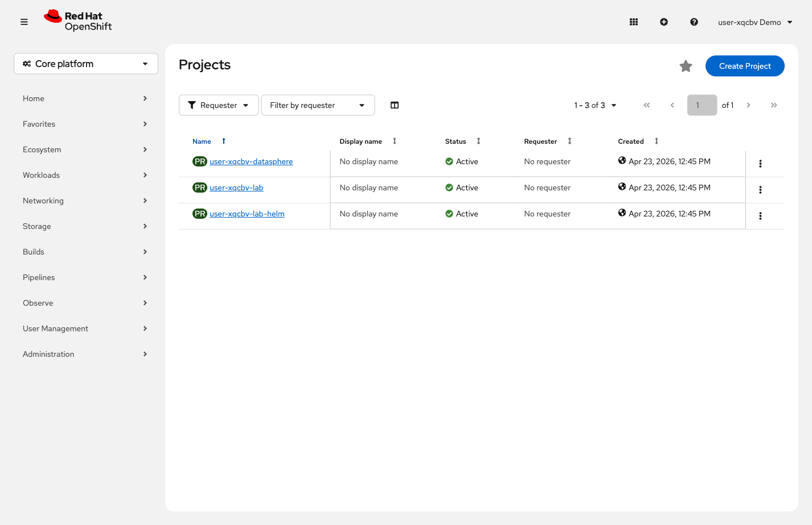
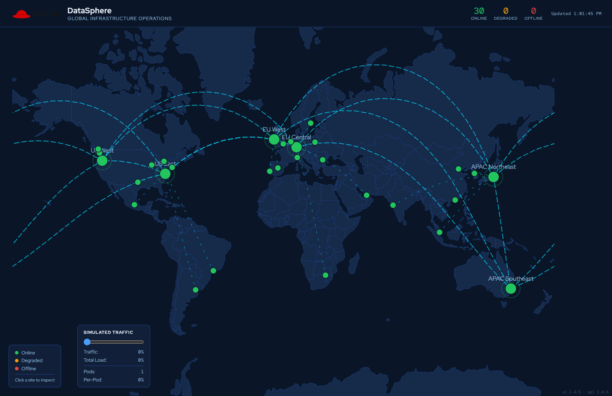

= Step 1.1: Open the application
:source-highlighter: highlightjs

[%collapsible]
.Using the Terminal (CLI)
====
[source,role="execute",subs="attributes+"]
----
oc project {user}-datasphere
----

Get the application URL:

[source,role="execute"]
----
oc get route datasphere-ui
----

Copy the URL from the `HOST/PORT` column and open it in a new browser tab.
====

[%collapsible]
.Using the Web Console
====
In the Core Platform view, click *`{user}-datasphere`* in the project list to open it.

// SCREENSHOT NEEDED: Core Platform Projects list with {user}-datasphere highlighted/selected, showing the click target

In the left navigation, expand *Networking* and click *Routes*.

// SCREENSHOT NEEDED: Networking → Routes in {user}-datasphere showing datasphere-ui route with the URL in the Location column
image::../../assets/images/console-guide/lab-01-deploy-the-app/01b-routes-datasphere-ui.png[Routes list showing the datasphere-ui route and its URL in the Location column]

Click the URL in the *Location* column to open the application in a new browser tab.
====

You'll see a live map of global datacenter sites. Click a site to toggle its status and
watch the map respond in real time.

// SCREENSHOT NEEDED: DataSphere app in the browser showing the live world map with green datacenter dots

TIP: Try to keep the Showroom lab interface and the DataSphere application visible side by side.
You'll be switching between them throughout the lab.

