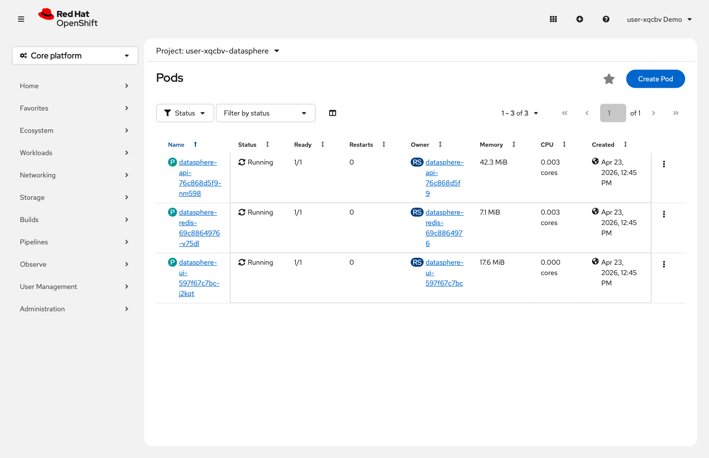

= Step 1.2: See what's running
:source-highlighter: highlightjs

[%collapsible]
.Using the Terminal (CLI)
====
[source,role="execute"]
----
oc get all
----

[%collapsible]
.Expected output
=====
[subs="attributes+"]
----
NAME                                    READY   STATUS    RESTARTS   AGE
pod/datasphere-api-7d464fc7c4-xxxxx     1/1     Running   0          5m
pod/datasphere-redis-69c8864976-xxxxx   1/1     Running   0          5m
pod/datasphere-ui-597f67c7bc-xxxxx      1/1     Running   0          5m

NAME                     TYPE        CLUSTER-IP       EXTERNAL-IP   PORT(S)    AGE
service/datasphere-api   ClusterIP   172.x.x.x        <none>        8080/TCP   5m
service/datasphere-ui    ClusterIP   172.x.x.x        <none>        8080/TCP   5m
service/redis            ClusterIP   172.x.x.x        <none>        6379/TCP   5m

NAME                               READY   UP-TO-DATE   AVAILABLE   AGE
deployment.apps/datasphere-api     1/1     1            1           5m
deployment.apps/datasphere-redis   1/1     1            1           5m
deployment.apps/datasphere-ui      1/1     1            1           5m

NAME                                          DESIRED   CURRENT   READY   AGE
replicaset.apps/datasphere-api-7d464fc7c4     1         1         1       5m
replicaset.apps/datasphere-redis-69c8864976   1         1         1       5m
replicaset.apps/datasphere-ui-597f67c7bc      1         1         1       5m

NAME                                                 REFERENCE                   TARGETS        MINPODS   MAXPODS   REPLICAS   AGE
horizontalpodautoscaler.autoscaling/datasphere-api   Deployment/datasphere-api   cpu: 16%/50%   1         5         1          5m

NAME                                     HOST/PORT
route.route.openshift.io/datasphere-ui   datasphere-ui-{user}-datasphere.apps.{openshift_cluster_ingress_domain}
----
=====

Notice: three Pods, three Services, three Deployments -- but only one Route. The API and Redis
have Services for internal communication, but only the frontend has a Route for external access.

NOTE: You may see more than one `datasphere-api` pod if the Horizontal Pod Autoscaler (HPA)
has already scaled the API up under simulated load -- that's expected. You may also see a
`WARNING: apps.openshift.io/v1 DeploymentConfig is deprecated` line in the output; this comes
from OpenShift's own internal components, not from DataSphere, and can be ignored.
====

[%collapsible]
.Using the Web Console
====
In the left navigation, expand *Workloads* and click *Pods*.

You'll see 3 pods: `datasphere-api`, `datasphere-redis`, and `datasphere-ui` -- all *Running*
with *1/1* Ready.
====

****
*What about Redis?* Redis is an in-memory data store. The API uses it to keep datacenter
state consistent across pod restarts and across multiple API replicas. You won't interact
with Redis directly in this lab -- it runs in the background as a supporting service.
****

