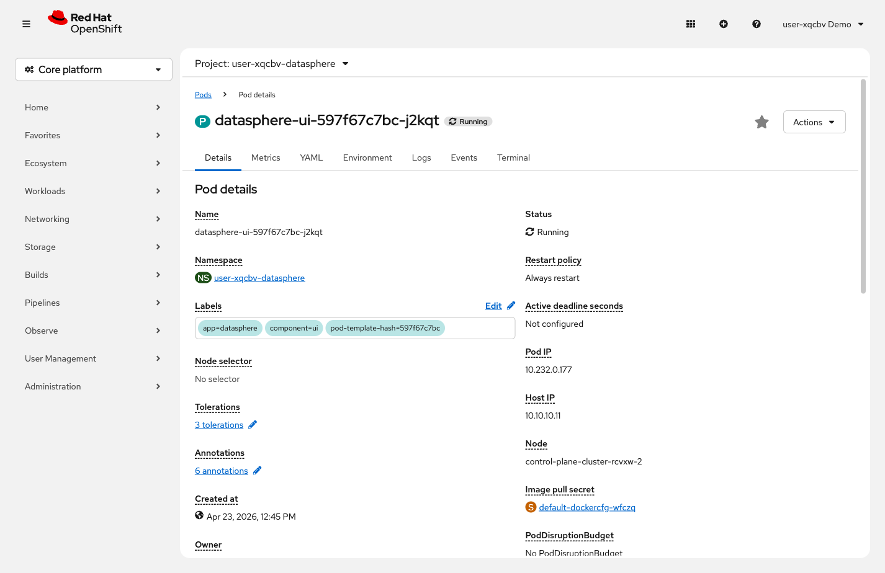

= Step 1.3: Explore the Pod
:source-highlighter: highlightjs

A *Pod* is the smallest deployable unit in OpenShift. It wraps one or more containers and gives
them a shared network and storage context. Pods are ephemeral -- they can be created, destroyed,
and replaced at any time. A *Deployment* manages this lifecycle and ensures the right number of
pods are always running.

[%collapsible]
.Using the Terminal (CLI)
====
Inspect the frontend pod in detail. The `-l component=ui` flag selects pods by label:

[source,role="execute"]
----
oc describe pod -l component=ui
----

[%collapsible]
.Expected output (key fields)
=====
[subs="attributes+"]
----
Name:         datasphere-ui-597f67c7bc-xxxxx
Namespace:    {user}-datasphere
Labels:       app=datasphere
              component=ui
Containers:
  ui:
    Image:    {datasphere_ui_image}
    Port:     8080/TCP
    State:    Running
    Ready:    True
----

NOTE: The actual output is longer -- it includes fields like Annotations, IP, Node,
and QoS Class. The output above highlights only the fields relevant to this step.
=====

Notice the *Labels*: `app=datasphere` and `component=ui`. These are how OpenShift connects
resources together -- Services find their Pods by matching these labels.

Check the application logs:

[source,role="execute"]
----
oc logs -l component=ui
----

These are the nginx access logs for the UI container. Each line records an HTTP request --
the URL, status code, and response size. If you opened the app in your browser, you'll
see `GET` requests for the page and its assets.

NOTE: If you see no output, open the application URL in your browser first, then run the command again.
====

[%collapsible]
.Using the Web Console
====
Click the name of the `datasphere-ui-*` pod to open its detail page.

Notice the *Labels* section: `app=datasphere` and `component=ui`. These labels are how the
Service finds this pod.

Click the *Logs* tab to see the live application logs. These are the nginx access logs for
the UI container -- each line records an HTTP request with the URL, status code, and
response size.
====

