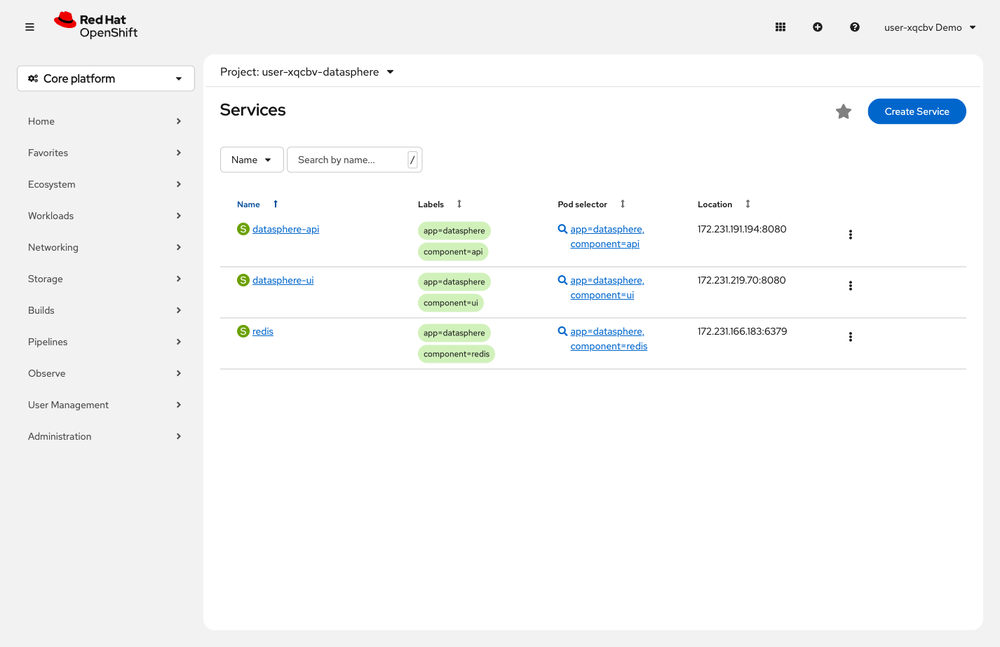
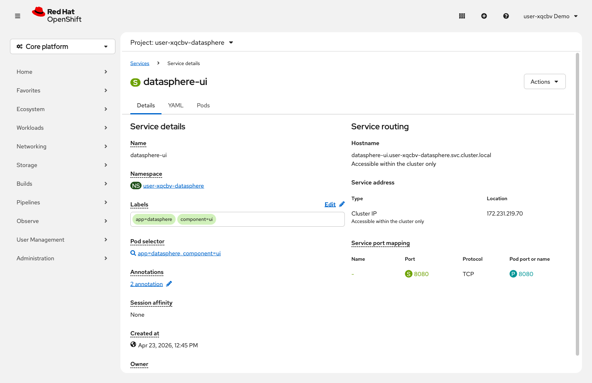

= Step 1.4: Explore the Service
:source-highlighter: highlightjs

A *Service* gives your application a stable internal network address. Even if the Pod restarts
and gets a new IP address, the Service address stays the same.

[%collapsible]
.Using the Terminal (CLI)
====
[source,role="execute"]
----
oc describe service datasphere-ui
----

[%collapsible]
.Expected output (key fields)
=====
----
Name:              datasphere-ui
Selector:          app=datasphere,component=ui
Type:              ClusterIP
Port:              8080/TCP
Endpoints:         10.x.x.x:8080
----

NOTE: The actual output includes additional fields like Namespace, Labels, IP Family Policy,
and Session Affinity. The output above highlights only the fields relevant to this step.
=====

Notice the *Selector* field: `app=datasphere,component=ui`. This label-based selection is how
OpenShift connects resources together -- the Service routes traffic to every Pod that matches.
====

[%collapsible]
.Using the Web Console
====
In the left navigation, expand *Networking* and click *Services*.

Click *datasphere-ui* to open the Service detail page.

Notice the *Pod selector* field: `app=datasphere, component=ui`. The *Hostname* shows the
internal DNS name -- `datasphere-ui.{user}-datasphere.svc.cluster.local` -- that other
applications inside the cluster use to reach this Service by name.
====

