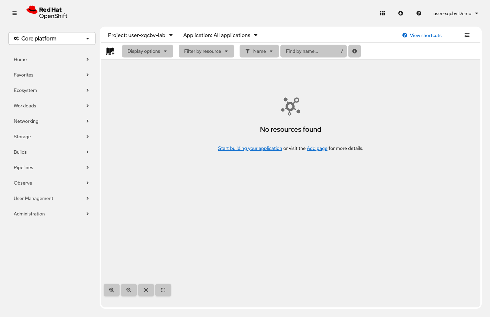

= Step 2.1: Switch to your clean project
:source-highlighter: highlightjs

[%collapsible]
.Using the Terminal (CLI)
====
[source,role="execute",subs="attributes+"]
----
oc project {user}-lab
----
====

[%collapsible]
.Using the Web Console
====
Click the perspective switcher in the upper left of the navigation panel and select *Developer*.
In the Project dropdown at the top of the content area, choose *`{user}-lab`*.

// SCREENSHOT NEEDED: Developer perspective Topology view showing {user}-lab selected and "No resources found" / empty state

====

This project is empty -- a clean workspace for you to build in.

