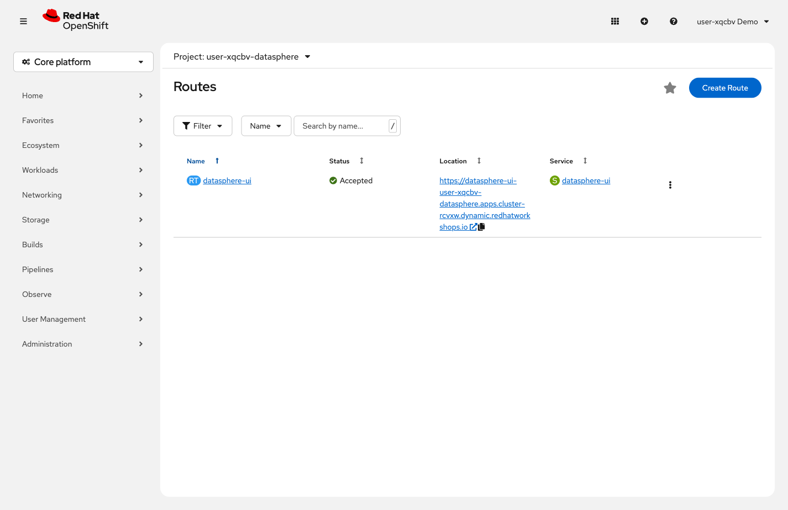
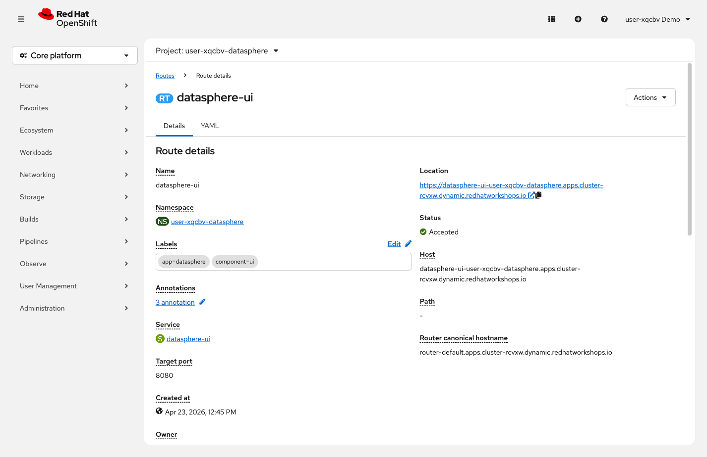

= Step 1.5: Explore the Route
:source-highlighter: highlightjs

A *Route* exposes a Service to traffic from outside the cluster. It provides a public hostname
and handles TLS termination automatically.

[%collapsible]
.Using the Terminal (CLI)
====
[source,role="execute"]
----
oc describe route datasphere-ui
----

[%collapsible]
.Expected output (key fields)
=====
[subs="attributes+"]
----
Name:            datasphere-ui
Host:            datasphere-ui-{user}-datasphere.{openshift_cluster_ingress_domain}
TLS Termination: edge
Insecure Policy: Redirect
Service:         datasphere-ui
Port:            8080
----

NOTE: As before, the actual output includes additional fields. This view highlights the
key fields: the public hostname, TLS termination type, and which Service the Route targets.
=====
====

[%collapsible]
.Using the Web Console
====
In the left navigation, click *Routes*.

Notice there is only *one* Route: `datasphere-ui`. The API and Redis have Services for internal
communication but no external Route. Click *datasphere-ui* to see the details.

The *Location* field is the public URL. OpenShift generates the hostname and manages TLS
automatically -- you only need to configure further if you want to customize your TLS strategy.
====

