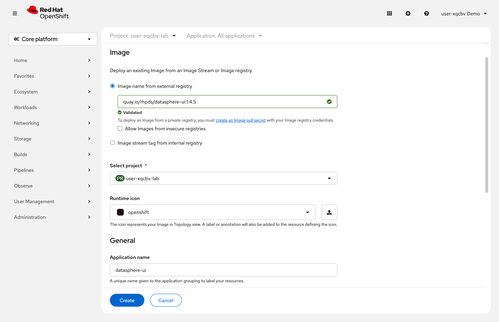
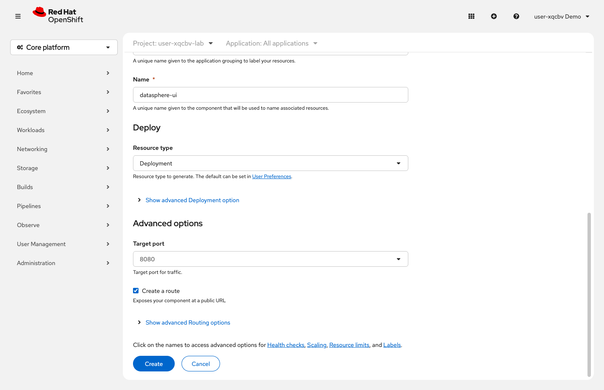

= Step 2.2: Deploy the application
:source-highlighter: highlightjs

[%collapsible]
.Using the Terminal (CLI)
====
Deploy the DataSphere UI from its container image:

[source,role="execute",subs="attributes+"]
----
oc new-app {datasphere_ui_image} --name=datasphere-ui
----

[%collapsible]
.Expected output
=====
----
--> Found container image ... ({datasphere_ui_image})
    ...
--> Creating resources ...
    imagestream.image.openshift.io "datasphere-ui" created
    deployment.apps "datasphere-ui" created
    service "datasphere-ui" created
--> Success
    Application is not exposed. You can expose services to the outside world by executing one or more of the commands below:
     'oc expose service/datasphere-ui'
    Run 'oc status' to view your app.
----
=====

`oc new-app` created three resources: an ImageStream, a Deployment, and a Service.
The output tells you the app isn't externally accessible yet -- you'll fix that next.

TIP: If you see `imagestreams.image.openshift.io "datasphere-ui" already exists`, the
ImageStream was already created from a previous attempt. Run
`oc delete all --selector app=datasphere-ui -n {user}-lab` to clean up, then re-run the
`oc new-app` command above.

Wait for the pod to come up:

[source,role="execute"]
----
oc rollout status deployment/datasphere-ui
----

[%collapsible]
.Expected output
=====
----
deployment "datasphere-ui" successfully rolled out
----
=====
====

[%collapsible]
.Using the Web Console
====
In the left navigation, click *+Add*, then click *Container images*.

Fill in the form:

. In the *Image name from external registry* field, enter: `{datasphere_ui_image}`
. Set *Name* to `datasphere-ui`.
. In the *Application Name* field, change the value to `datasphere-ui` (the form
  may auto-fill this as `datasphere-ui-app` -- remove the `-app` suffix).
  This groups components together in the Topology view -- naming it clearly
  will matter when you add the API in the next step.

// SCREENSHOT NEEDED: Deploy Image form showing {datasphere_ui_image} (1.4.5) in the image field, Name=datasphere-ui, Application Name=datasphere-ui filled in

. Scroll down to *Advanced options*. Confirm *Target port* is *8080*, then check the
  *Create a route* checkbox.
+
// SCREENSHOT NEEDED: Deploy Image Advanced Options section showing Target Port=8080 and Create a route checkbox checked

+
. Click *Create*.

OpenShift creates a Deployment, a Service, and an edge-terminated Route in one step.
Wait for the pod ring in *Topology* to turn solid blue before continuing.

TIP: If you see an error that a resource already exists, a previous attempt left
resources behind. Switch to the *Terminal* tab and run
`oc delete all --selector app=datasphere-ui -n {user}-lab` to clean up, then try again.
====

NOTE: This same rollout process happens every time you deploy a new version. OpenShift creates
new pods first, waits for them to be healthy, then scales down the old ones -- no downtime,
no manual coordination.

