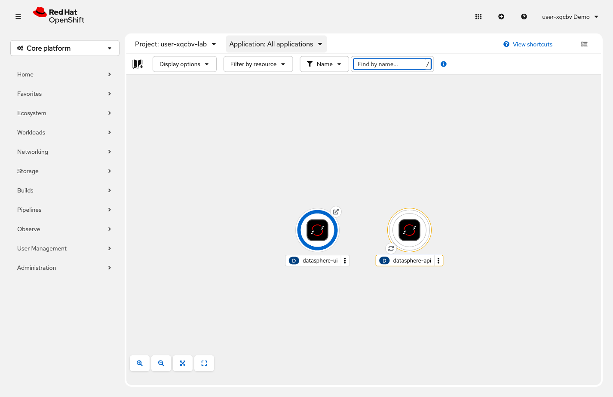

= Step 2.4: Verify the deployment
:source-highlighter: highlightjs

[%collapsible]
.Using the Terminal (CLI)
====
[source,role="execute"]
----
oc get route datasphere-ui
----

[%collapsible]
.Expected output
=====
[subs="attributes+"]
----
NAME            HOST/PORT                                                          PATH   SERVICES        PORT       TERMINATION   WILDCARD
datasphere-ui   datasphere-ui-{user}-lab.{openshift_cluster_ingress_domain}              datasphere-ui   8080-tcp   edge          None
----
=====

Copy the URL from the `HOST/PORT` column and open it in your browser.
====

[%collapsible]
.Using the Web Console
====
In *Topology*, click the *open URL* icon (the arrow-in-box icon in the top-right corner of
the `datasphere-ui` node) to open the application in a new browser tab.

// SCREENSHOT NEEDED: Topology view showing the datasphere-ui node with an arrow or callout pointing to the open URL icon in its top-right corner

====

The DataSphere UI loads -- but the map is empty. No datacenter sites, no status data.

That's not a bug. The UI is running exactly as it should: it's already calling out to
`datasphere-api:8080`, looking for the backend. But there's no pod answering that address yet.
You've deployed the frontend. The backend doesn't exist in this project.

