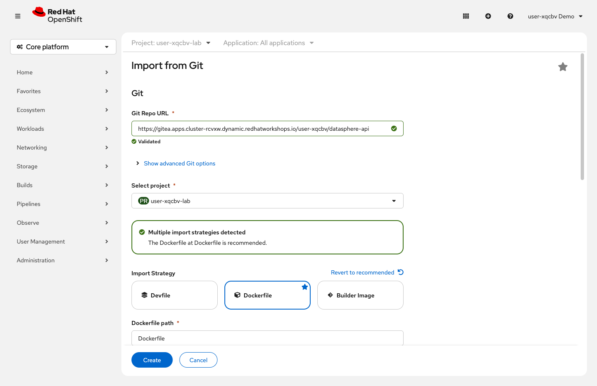
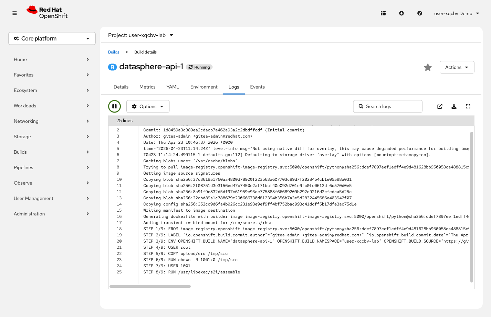

= Step 2.6: Build and deploy the API from source
:source-highlighter: highlightjs

[%collapsible]
.Using the Terminal (CLI)
====
The `python~` prefix tells OpenShift two things: use the Python builder image, and build from
the source that follows. OpenShift clones the repository, detects `requirements.txt`,
installs dependencies, and packages everything into a container image -- all inside the cluster.

[source,role="execute",subs="attributes+"]
----
oc new-app python~{gitea_url}/{user}/datasphere-api --name=datasphere-api
----

[%collapsible]
.Expected output
=====
----
--> Found image ... (Python 3.12 on UBI 8)
    ...
--> Creating resources ...
    imagestream.image.openshift.io "datasphere-api" created
    buildconfig.build.openshift.io "datasphere-api" created
    deployment.apps "datasphere-api" created
    service "datasphere-api" created
--> Success
    Build scheduled, use 'oc logs -f buildconfig/datasphere-api' to track its progress.
----
=====

Notice the `buildconfig` in the output -- that wasn't there when you deployed the UI from a
pre-built image.

Watch the build run inside the cluster:

[source,role="execute"]
----
oc logs -f buildconfig/datasphere-api
----

[%collapsible]
.Expected output (truncated)
=====
----
Cloning "https://gitea.../datasphere-api" ...
STEP 1/9: FROM image-registry.openshift-image-registry.svc:5000/openshift/python:latest
...
Collecting fastapi
Collecting uvicorn
...
Successfully installed fastapi-0.115.0 uvicorn-0.31.0 ...
Pushing image image-registry.openshift-image-registry.svc:5000/{user}-lab/datasphere-api:latest ...
Push successful
----
=====

Wait for the deployment:

[source,role="execute"]
----
oc rollout status deployment/datasphere-api
----

[%collapsible]
.Expected output
=====
----
deployment "datasphere-api" successfully rolled out
----
=====
====

[%collapsible]
.Using the Web Console
====
In the left navigation, click *+Add*, then click *Import from Git*.

. In the *Git Repo URL* field, paste: `{gitea_url}/{user}/datasphere-api`
. OpenShift detects the repository and selects a build strategy. If it shows *Dockerfile*
  instead of *Builder Image*, click *Edit Import Strategy* and select *Builder Image*,
  then choose the *Python* builder.
. Open the *Application* dropdown (not the *Application Name* text field below it)
  and select *No Application Group* -- the API should be separate from the
  `datasphere-ui` group you created in Step 2.2.
. Set *Name* to `datasphere-api`. The *Application Name* field should clear itself
  when you select *No Application Group*; if it doesn't, leave it blank.
. Scroll down to *Advanced options* and *uncheck* *Create a Route* -- the API should
  not be publicly accessible.
. Click *Create*.

// SCREENSHOT NEEDED: Import from Git form showing Gitea URL pasted, Builder Image selected (Python), Application=No Application Group, Name=datasphere-api, Create Route unchecked

To watch the build progress:

. In the left navigation, click *Builds*.
. Click the *datasphere-api* BuildConfig that appears.
. Select the *Builds* tab, click the build name, then click *Logs*.

// SCREENSHOT NEEDED: Build Logs page for datasphere-api-1 showing the S2I build output with pip install lines and "Push successful" at the end

When the build shows *Complete*, the Deployment starts automatically.
====

That entire build ran inside the cluster: no Docker installed locally, no CI/CD pipeline
configured, no external registry account needed.

