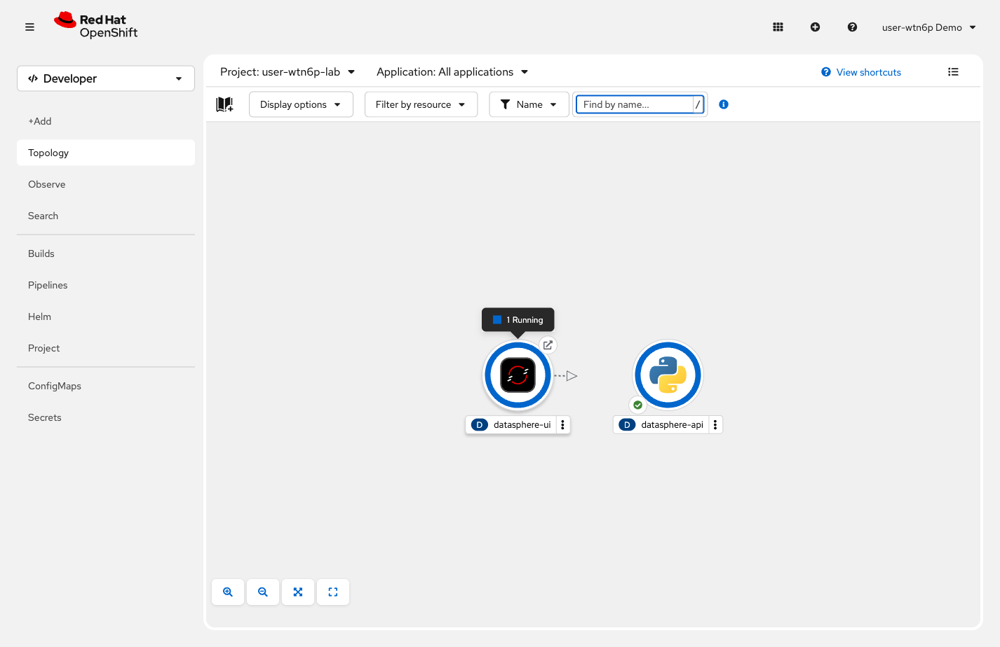

= Step 2.7: Watch the map come to life
:source-highlighter: highlightjs

[%collapsible]
.Using the Terminal (CLI)
====
[source,role="execute"]
----
oc get route datasphere-ui
----

Copy the URL from the `HOST/PORT` column and open it in your browser.
====

[%collapsible]
.Using the Web Console
====
In *Topology*, both `datasphere-ui` and `datasphere-api` now appear with solid blue rings.
Notice that `datasphere-api` shows a *Python logo* -- the console detected the Python
builder used in Step 2.6 and set the icon automatically.

Click the *open URL* icon (the arrow-in-box in the top-right corner) on the `datasphere-ui`
node to open the application.

====

The map is now populated with datacenter sites. You didn't reconfigure the UI. You didn't update
any hostnames or IP addresses. The moment `datasphere-api` came online as a Service in this
project, the UI found it automatically.

This is OpenShift's internal DNS in practice: the UI is configured to forward `/api/` requests
to `datasphere-api:8080`. OpenShift resolves that name to the Service, which routes to the pod.
Add a backend, the frontend connects to it. That's it.

