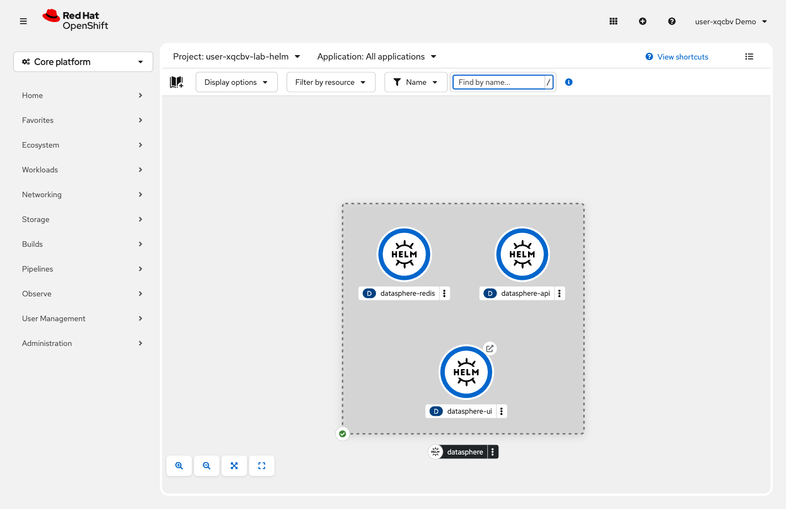

= Step 3.3: Verify the application
:source-highlighter: highlightjs

[%collapsible]
.Using the Terminal (CLI)
====
[source,role="execute"]
----
oc get route datasphere-ui
----

Copy the URL from the `HOST/PORT` column and open it in your browser.
====

[%collapsible]
.Using the Web Console
====
In *Topology*, all three components appear together -- UI, API, and Redis -- deployed as a
single Helm release.

// SCREENSHOT NEEDED: Topology view in {user}-lab-helm showing datasphere-ui, datasphere-api, AND datasphere-redis all deployed with solid blue rings (3 components from the Helm chart)

Click the *open URL* icon on `datasphere-ui` to open the application.
====

All three components -- UI, API, and Redis -- fully operational, from a single command. Every
resource you created across Section 2 was created here in one shot, plus a Redis database,
with no opportunity for steps to be missed or applied in the wrong order.

