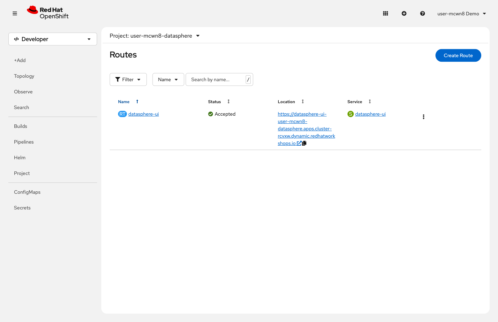

= Step 0.1: Open the DataSphere app
:source-highlighter: highlightjs

[%collapsible]
.Using the Terminal (CLI)
====
Make sure you're in the `{user}-datasphere` project:

[source,role="execute",subs="attributes+"]
----
oc project {user}-datasphere
----

[%collapsible]
.Expected output
=====
[subs="attributes+"]
----
Already on project "{user}-datasphere" on server "{openshift_api_url}".
----
=====

Get the application URL:

[source,role="execute"]
----
oc get route datasphere-ui
----

[%collapsible]
.Expected output
=====
[subs="attributes+"]
----
NAME            HOST/PORT                                                                           PATH   SERVICES        PORT   TERMINATION     WILDCARD
datasphere-ui   datasphere-ui-{user}-datasphere.{openshift_cluster_ingress_domain}                        datasphere-ui   8080   edge/Redirect   None
----
=====

Copy the URL from the `HOST/PORT` column and open it in a new browser tab.
====

[%collapsible]
.Using the Web Console
====
Make sure you are in the *`{user}-datasphere`* project. If you followed the *Get connected*
steps above, you should already be there. If not, click the project name at the top of the
page and select *`{user}-datasphere`*.

In the left navigation, expand *Networking* and click *Routes*.

// SCREENSHOT NEEDED: Networking → Routes in {user}-datasphere, showing datasphere-ui route with URL in Location column

Click the URL in the *Location* column to open the DataSphere app in a new browser tab.
====

You should see the DataSphere map with datacenter sites displayed across the globe.

NOTE: If you're already familiar with ReplicaSets and manual scaling, skip ahead to
xref:../04-section-1-what-keeps-your-app-running/04-step-1-3-auto-scaling-under-load.adoc[] to see auto-scaling in action.
