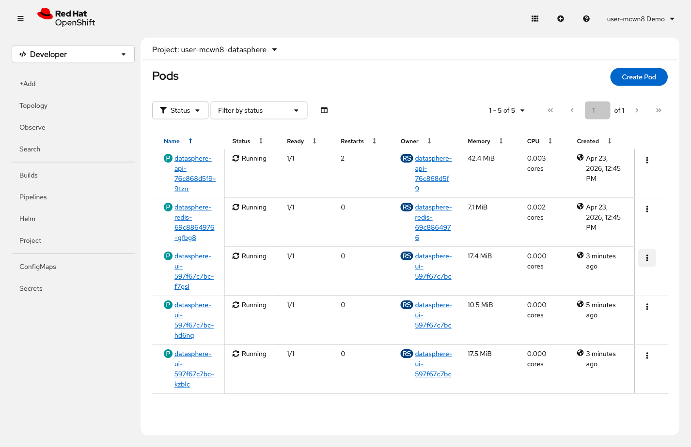

= Step 1.4: Health probe: detect a sick pod
:source-highlighter: highlightjs

What if a pod is still running but broken? A crashed pod gets replaced by the ReplicaSet,
but a sick pod that's alive and consuming normal CPU needs a different mechanism: the liveness probe.

The DataSphere API has a liveness probe on the `/health` endpoint. If it fails 3 times in a
row, OpenShift restarts the container. A readiness probe on the same endpoint removes the pod
from the Service load balancer the moment it stops passing -- so no traffic reaches the broken pod.

Trigger a health failure. Switch to the *Terminal* tab and run:

[source,role="execute",subs="attributes+"]
----
curl -s -X POST https://$(oc get route datasphere-ui -o jsonpath='{.spec.host}')/api/break
----

[%collapsible]
.Expected output
====
----
{"status":"broken","message":"Health check will now fail. OCP will restart this pod."}
----
====

NOTE: This request hit 1 of the API pods through the Service load balancer. Only that pod
has its health flag set to broken -- the others remain healthy.

[%collapsible]
.Using the Terminal (CLI)
====
Watch the pods:

[source,role="execute"]
----
watch oc get pods --selector component=api
----

Within 30 seconds, the *RESTARTS* column increments on one pod. Press `Ctrl+C` to stop.
====

[%collapsible]
.Using the Web Console
====
Go to *Workloads* → *Pods* and watch the `datasphere-api-*` pods. Within about 40 seconds:

. One pod shows `0/1` in the *Ready* column: the readiness probe pulled it from the Service
. The *Restarts* counter increments: the liveness probe restarted the container

// SCREENSHOT NEEDED: Workloads → Pods showing datasphere-api pods — one pod with Restarts = 1 (or showing 0/1 Ready transitioning), others still Running

TIP: Click the restarted API pod name and open the *Events* tab to see the liveness probe
failure events that triggered the restart.
====

[NOTE]
====
Notice the difference from Step 1.1: deleting a pod removes it entirely and the ReplicaSet
creates a replacement. Here, the liveness probe *restarts* the existing container in place.
Probes catch sick applications; ReplicaSets catch dead ones.
====
