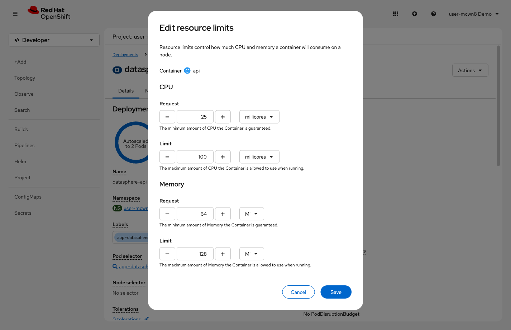
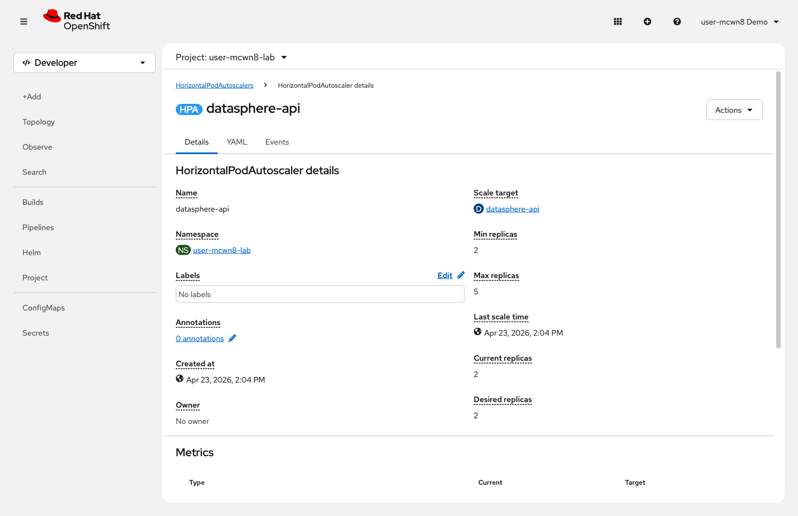

= Step 2.3: Add resource limits and auto-scaling
:source-highlighter: highlightjs

The HPA needs CPU metrics to make scaling decisions. Resource requests define the baseline
("25 millicores is what this pod needs at rest") -- without them, the HPA has nothing to
measure against.

[%collapsible]
.Using the Terminal (CLI)
====
Set resource requests and limits on the API deployment:

[source,role="execute"]
----
oc set resources deployment/datasphere-api --requests=cpu=25m,memory=64Mi --limits=cpu=100m,memory=128Mi
----

[%collapsible]
.Expected output
=====
----
deployment.apps/datasphere-api resource requirements updated
----
=====

Create the HPA with a minimum of 2 replicas:

[source,role="execute"]
----
oc autoscale deployment/datasphere-api --min=2 --max=5 --cpu=50%
----

[%collapsible]
.Expected output
=====
----
horizontalpodautoscaler.autoscaling/datasphere-api autoscaled
----
=====

Check the HPA. It takes about 60 seconds for the metrics server to report the first CPU reading:

[source,role="execute"]
----
oc get hpa
----

[%collapsible]
.Expected output (initial)
=====
----
NAME             REFERENCE                   TARGETS              MINPODS   MAXPODS   REPLICAS   AGE
datasphere-api   Deployment/datasphere-api   cpu: <unknown>/50%   2         5         1          10s
----
=====

NOTE: `REPLICAS` shows 1 briefly even though `--min=2` was set -- the HPA enforces the
minimum after the first metrics collection cycle, about 60 seconds after creation.

After about 60 seconds, check again:

[source,role="execute"]
----
oc get hpa
----

[%collapsible]
.Expected output (after metrics available)
=====
----
NAME             REFERENCE                   TARGETS              MINPODS   MAXPODS   REPLICAS   AGE
datasphere-api   Deployment/datasphere-api   cpu: 8%/50%          2         5         2          90s
----
=====
====

[%collapsible]
.Using the Web Console
====
. In *Workloads* → *Deployments*, click *datasphere-api*, then click *Actions* → *Edit resource limits*.

// SCREENSHOT NEEDED: Actions → Edit resource limits dialog on datasphere-api Deployment with CPU/Memory Request and Limit fields filled in (25m/100m CPU, 64Mi/128Mi memory)

. Set these values and click *Save*:
+
* *CPU Request*: `25m`
* *CPU Limit*: `100m`
* *Memory Request*: `64Mi`
* *Memory Limit*: `128Mi`

. Click *Actions* → *Add HorizontalPodAutoscaler*.

// SCREENSHOT NEEDED: Actions → Add HorizontalPodAutoscaler form on datasphere-api, filled in with Name=datasphere-api, Min=2, Max=5, CPU=50
image::../../assets/images/console-guide/lab-02-apps-never-down/15-add-hpa-form.png[Add HorizontalPodAutoscaler form showing Name, Minimum Pods, Maximum Pods and CPU Utilization fields]

. Fill in the form and click *Save*:
+
* *Name*: `datasphere-api`
* *Minimum Pods*: `2`
* *Maximum Pods*: `5`
* *CPU Utilization*: `50`
====

A few things worth knowing about the HPA you just created:

* *`--cpu` threshold*: 50% is a reasonable starting point. Latency-sensitive services
  might use 30% (more headroom before scaling kicks in); batch workloads might use 70%.

* *Scale-down stabilization window*: The HPA you just created uses the production default
  of 5 minutes before removing pods after load drops. The pre-deployed DataSphere uses
  20 seconds for demo purposes. The longer window prevents oscillation if load fluctuates.

* *Multiple metrics*: HPA can also scale on memory, custom metrics, or external metrics
  like message queue depth. CPU is the most common starting point.

Now test it. Open the DataSphere app you deployed in Step 2.2 and drag the
*Simulated Traffic* slider to about *50%*:

[%collapsible]
.Using the Terminal (CLI)
====
[source,role="execute"]
----
watch -n 2 "echo '=== Auto-Scaler ==='; oc get hpa; echo; echo '=== Pods ==='; oc get pods --selector component=api"
----

Watch the replica count climb past 2 as CPU crosses 50%. Slide back to *0%* when done,
then press `Ctrl+C`. Note that scale-down takes up to 5 minutes with the production
stabilization window -- you don't need to wait for it.
====

[%collapsible]
.Using the Web Console
====
Watch the HPA details page (*Workloads* → *HorizontalPodAutoscalers* → *datasphere-api*).
The *Current replicas* count climbs as CPU crosses the threshold.

// SCREENSHOT NEEDED: HPA details page while scaled up — showing Current replicas > 2, Desired replicas climbing, and Last scale time updated

Slide back to *0%* when done.
====
