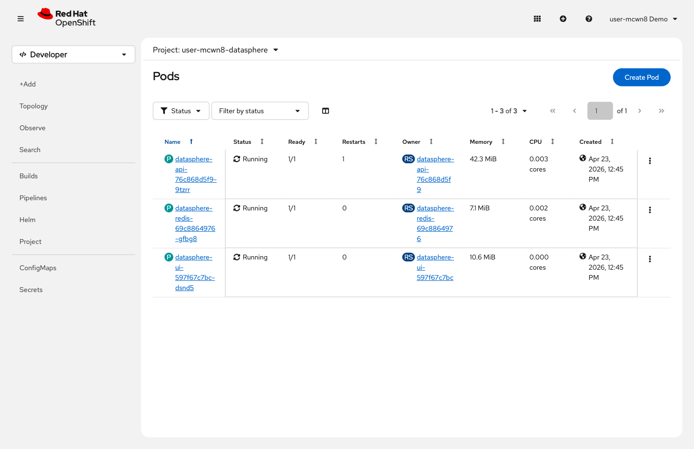
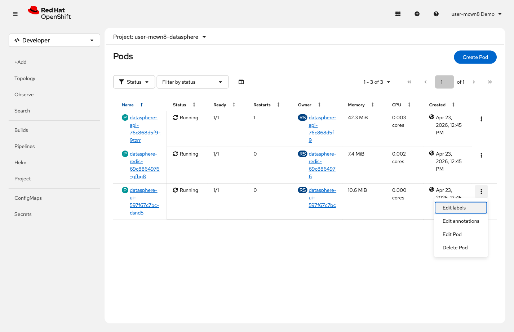
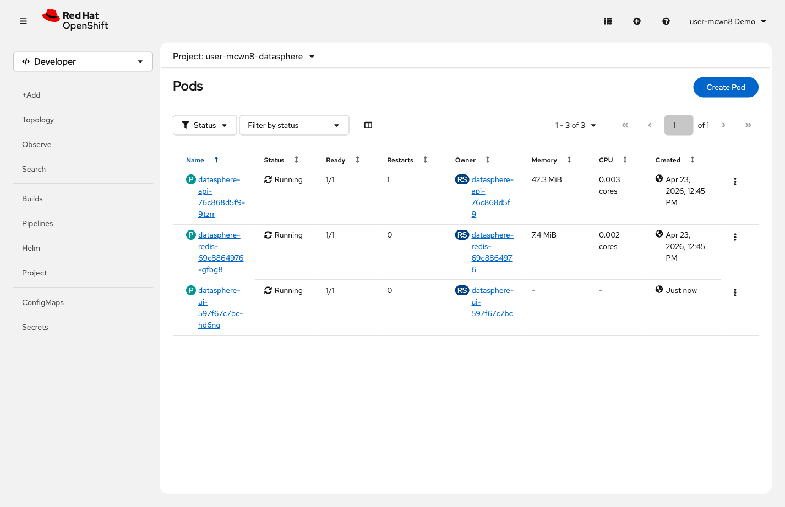

= Step 1.1: Delete a pod
:source-highlighter: highlightjs

A ReplicaSet is the controller that ensures a specified number of pod replicas are running
at any time. When a pod is deleted or crashes, the ReplicaSet creates a replacement immediately.

[%collapsible]
.Using the Terminal (CLI)
====
Check how many UI pods are running:

[source,role="execute"]
----
oc get pods --selector component=ui
----

[%collapsible]
.Expected output
=====
----
NAME                             READY   STATUS    RESTARTS   AGE
datasphere-ui-7c9d8e6f4-m3n7p   1/1     Running   0          10m
----
=====

1 pod. Delete it:

[source,role="execute"]
----
oc delete pod $(oc get pod --selector component=ui -o jsonpath='{.items[0].metadata.name}')
----

[%collapsible]
.Expected output
=====
----
pod "datasphere-ui-7c9d8e6f4-m3n7p" deleted
----
=====

Check the pods again:

[source,role="execute"]
----
oc get pods --selector component=ui
----

[%collapsible]
.Expected output
=====
----
NAME                             READY   STATUS    RESTARTS   AGE
datasphere-ui-7c9d8e6f4-pq8x2   1/1     Running   0          8s
----
=====

A new pod is already running. The ReplicaSet detected the missing pod and created a
replacement automatically.
====

[%collapsible]
.Using the Web Console
====
In the left navigation, click *Workloads* → *Pods*.

// SCREENSHOT NEEDED: Workloads → Pods in {user}-datasphere showing all 3 pods (api, redis, ui) Running with 0 Restarts

You will see 3 pods running: the API, Redis, and UI. Note the *Restarts* column is 0 for all.

Click the three-dot menu (*⋮*) to the right of the `datasphere-ui-*` pod and select *Delete Pod*.

// SCREENSHOT NEEDED: Pods list with three-dot menu (⋮) open on the datasphere-ui pod, showing "Delete Pod" option

Click *Delete* in the confirmation dialog.

Watch the list -- the deleted pod moves to *Terminating* while OpenShift immediately creates
a replacement in *ContainerCreating*, then *Running*.

// SCREENSHOT NEEDED: Pods list mid-replacement — old datasphere-ui pod in Terminating status, new pod in ContainerCreating or Running

====

OpenShift replaced the pod automatically through the ReplicaSet controller. With only 1
replica, any pod failure causes a brief outage until the replacement starts.
