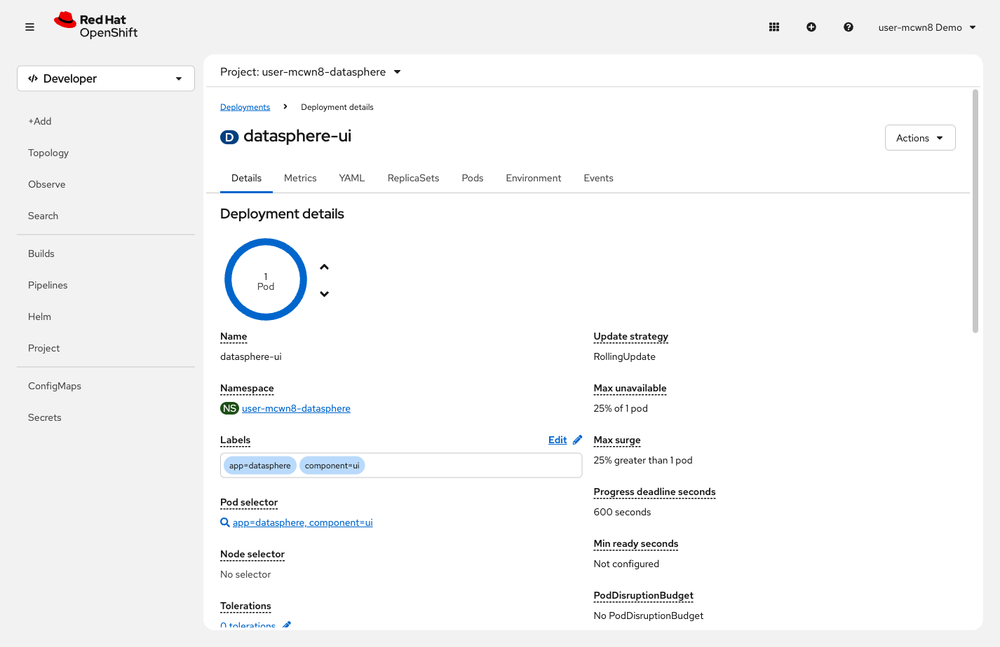
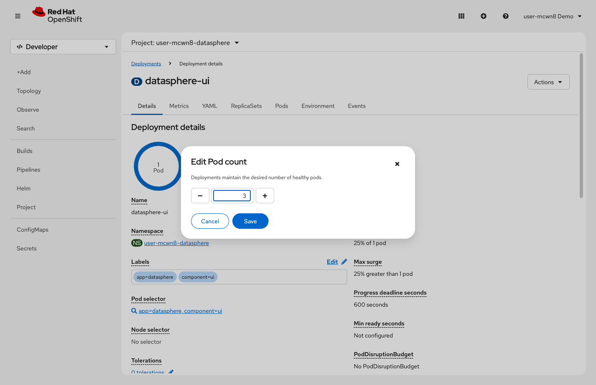
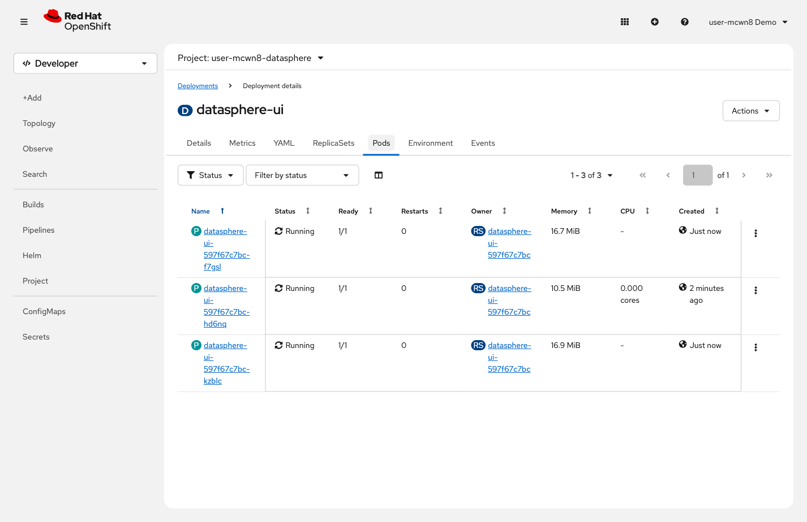
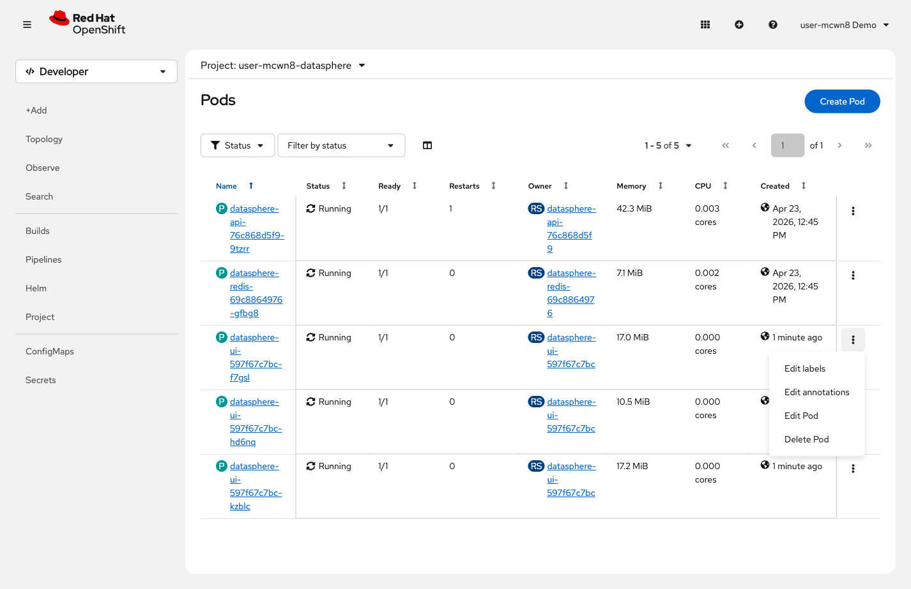

= Step 1.2: Run multiple replicas
:source-highlighter: highlightjs

With 3 replicas, losing 1 pod leaves 2 still serving traffic -- no outage.

[%collapsible]
.Using the Terminal (CLI)
====
Scale the UI deployment to 3 replicas:

[source,role="execute"]
----
oc scale deployment datasphere-ui --replicas=3
----

[%collapsible]
.Expected output
=====
----
deployment.apps/datasphere-ui scaled
----
=====

Wait until all 3 pods are ready:

[source,role="execute"]
----
oc wait --for=condition=ready pod --selector component=ui --timeout=60s
----

[%collapsible]
.Expected output
=====
----
pod/datasphere-ui-7c9d8e6f4-pq8x2 condition met
pod/datasphere-ui-7c9d8e6f4-rs1k9 condition met
pod/datasphere-ui-7c9d8e6f4-tv4j6 condition met
----
=====

Now delete one pod:

[source,role="execute"]
----
oc delete pod $(oc get pod --selector component=ui -o jsonpath='{.items[0].metadata.name}')
----

Check the pods again immediately:

[source,role="execute"]
----
oc get pods --selector component=ui
----

[%collapsible]
.Expected output
=====
----
NAME                             READY   STATUS    RESTARTS   AGE
datasphere-ui-7c9d8e6f4-pq8x2   1/1     Running   0          5m
datasphere-ui-7c9d8e6f4-rs1k9   1/1     Running   0          4m
datasphere-ui-7c9d8e6f4-zt9w1   0/1     Running   0          3s
----
=====

2 pods continue serving traffic. The third is already starting. The Service never stops
routing to the 2 healthy pods -- no outage.
====

[%collapsible]
.Using the Web Console
====
In the left navigation, click *Workloads* → *Deployments*, then click *datasphere-ui*.

// SCREENSHOT NEEDED: Workloads → Deployments → datasphere-ui detail page, showing the pod donut/count and the Actions menu

Click *Actions* → *Edit Pod count*. Change the value to `3` and click *Save*.

// SCREENSHOT NEEDED: Edit Pod count dialog with value changed to 3, before clicking Save

Click the *Pods* tab and wait until all 3 replicas show `1/1` in the *Ready* column.

// SCREENSHOT NEEDED: Pods tab on datasphere-ui Deployment detail page showing all 3 replicas at 1/1 Running

Return to *Workloads* → *Pods*. Click the three-dot menu (*⋮*) on any `datasphere-ui-*`
pod and select *Delete Pod* → *Delete*.

// SCREENSHOT NEEDED: Pods list (Workloads → Pods) showing 3 datasphere-ui pods, with three-dot menu open on one showing Delete Pod

Watch the list: the deleted pod terminates while the 2 survivors keep running. OpenShift
starts a third replacement immediately. The Service kept routing to the 2 healthy pods
throughout -- no outage.
====

[NOTE]
====
With multiple replicas, the Service load-balances across all pods with matching labels.
Losing 1 pod out of 3 means the other 2 handle requests without interruption. This is
why production workloads always run more than 1 replica.
====
