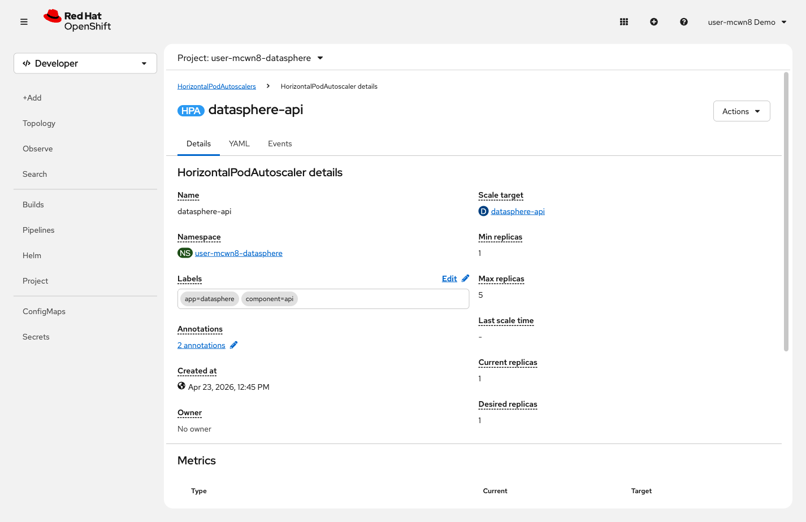
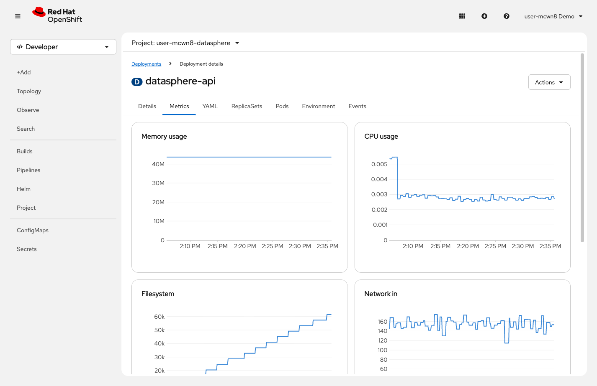

= Step 1.3: Auto-scaling under load
:source-highlighter: highlightjs

You just scaled manually. That works, but it requires you to be watching. What if traffic
spikes at 3am?

The Horizontal Pod Autoscaler (HPA) watches CPU metrics and automatically adjusts the pod
count. When CPU climbs above a threshold, it adds pods. When load drops, it removes them.
The pre-deployed DataSphere API already has an HPA configured.

[%collapsible]
.Using the Terminal (CLI)
====
Check the current HPA:

[source,role="execute"]
----
oc get hpa
----

[%collapsible]
.Expected output
=====
----
NAME             REFERENCE                   TARGETS        MINPODS   MAXPODS   REPLICAS   AGE
datasphere-api   Deployment/datasphere-api   cpu: 12%/50%   1         5         1          15m
----
=====

The `TARGETS` column shows current CPU utilization versus the 50% threshold that triggers
scaling. The following command combines several views into a live dashboard -- run it now,
then drag the DataSphere *Simulated Traffic* slider to about *50%*:

[source,role="execute"]
----
watch -n 2 "echo '=== Auto-Scaler ==='; oc get hpa; echo; echo '=== Pod CPU ==='; oc adm top pods --selector component=api; echo; echo '=== Pods ==='; oc get pods --selector component=api"
----

NOTE: Make sure the DataSphere slider is at 0% before starting. If the API has already
scaled up from earlier activity, the HPA numbers will not reflect a clean baseline.

[%collapsible]
.Expected output (after load applied)
=====
----
=== Auto-Scaler ===
NAME             REFERENCE                   TARGETS        MINPODS   MAXPODS   REPLICAS   AGE
datasphere-api   Deployment/datasphere-api   cpu: 63%/50%   1         5         5          16m

=== Pod CPU ===
NAME                              CPU(cores)   MEMORY(bytes)
datasphere-api-5d4f8b7c9-abc12   18m          62Mi
datasphere-api-5d4f8b7c9-def34   22m          59Mi
datasphere-api-5d4f8b7c9-ghi56   21m          61Mi
datasphere-api-5d4f8b7c9-xyz99   8m           45Mi
datasphere-api-5d4f8b7c9-wv3r2   7m           44Mi

=== Pods ===
NAME                              READY   STATUS    RESTARTS   AGE
datasphere-api-5d4f8b7c9-abc12   1/1     Running   0          5m
datasphere-api-5d4f8b7c9-def34   1/1     Running   0          5m
datasphere-api-5d4f8b7c9-ghi56   1/1     Running   0          5m
datasphere-api-5d4f8b7c9-xyz99   1/1     Running   0          22s
datasphere-api-5d4f8b7c9-wv3r2   1/1     Running   0          10s
----
=====

Slide back to *0%*. The HPA scales down over about 20 seconds. Press `Ctrl+C` to stop the watch.
====

[%collapsible]
.Using the Web Console
====
In the left navigation, click *Workloads* → *HorizontalPodAutoscalers*. Click *datasphere-api*.

// SCREENSHOT NEEDED: Workloads → HorizontalPodAutoscalers → datasphere-api detail page, showing Min/Max replicas, Current replicas, and the Conditions section

This page shows *Current replicas* and *Desired replicas* in real time.

Open the `datasphere-api` Deployment (*Workloads* → *Deployments* → *datasphere-api*) and
click the *Metrics* tab for a live CPU graph.

// SCREENSHOT NEEDED: datasphere-api Deployment → Metrics tab showing CPU usage graph (capture while load is being applied so the spike is visible)

Drag the *Simulated Traffic* slider in the DataSphere app to about *50%* and watch the
*Current replicas* count climb on the HPA page as CPU crosses the threshold. Slide back
to *0%* when done.
====

[NOTE]
====
The HPA scales up quickly (within 15--30 seconds of crossing the threshold) but scales
down more slowly. The pre-deployed DataSphere uses a 20-second scale-down stabilization
window for demo purposes. The production default is 5 minutes: this prevents oscillation
if load fluctuates up and down.
====
