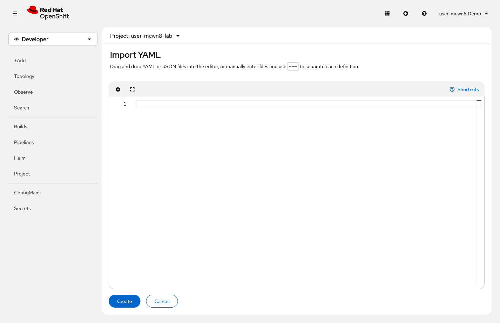
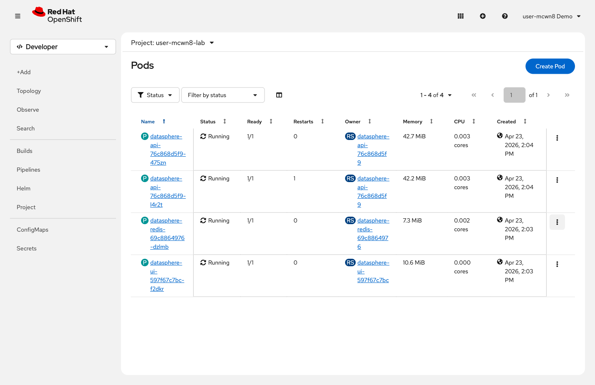

= Step 2.2: Deploy the full stack
:source-highlighter: highlightjs

A Helm chart bundles all the Kubernetes manifests for an application -- Deployments, Services,
Routes, ConfigMaps -- into a single installable package with configurable values. Instead of
running multiple `oc create` commands, you run one `helm install`.

You'll install DataSphere with the resilience features deliberately disabled: no probes, no
resource limits, no auto-scaler. This gives you a clean baseline so you can add each feature
yourself and see exactly what each piece does.

NOTE: In production you'd ship with all resilience features enabled from day one. We're
stripping them here so you can build them up step by step and understand what each one provides.

[%collapsible]
.Using the Terminal (CLI)
====
Install DataSphere with resilience features disabled:

[source,role="execute",subs="attributes+"]
----
helm install datasphere {gitea_url}/api/packages/gitea-admin/helm/datasphere-{datasphere_helm_version}.tgz --set api.hpa.enabled=false --set api.probes.enabled=false --set api.resources.enabled=false
----

[%collapsible]
.Expected output
=====
----
NAME: datasphere
LAST DEPLOYED: ...
NAMESPACE: ...
STATUS: deployed
REVISION: 1
----
=====

Wait until all pods are ready:

[source,role="execute"]
----
watch oc get pods
----

[%collapsible]
.Expected output (when ready)
=====
[subs="attributes+"]
----
NAME                                    READY   STATUS    RESTARTS   AGE
datasphere-api-6b8c9d7f5-x4k2m         1/1     Running   0          30s
datasphere-redis-69c8864976-v668h       1/1     Running   0          30s
datasphere-ui-597f67c7bc-m3n7p          1/1     Running   0          30s
----
=====

Press `Ctrl+C` when all pods show `1/1 Running`.

Get the application URL and open it in a new browser tab:

[source,role="execute"]
----
oc get route datasphere-ui
----
====

[%collapsible]
.Using the Web Console
====
. In the top navigation bar, click *Quick create* and select *Import YAML* to open the YAML editor.
. Paste the following into the editor:
+
[source,yaml,role="copypaste"]
----
include::../../../partials/datasphere-lab-manifests.yaml[]
----
+
. Click *Create*.

// SCREENSHOT NEEDED: Import YAML editor (⊕ button) in {user}-lab with DataSphere manifests pasted in, Create button visible at bottom

When all resources show *Created* status:

// SCREENSHOT NEEDED: Post-create resource list showing all DataSphere resources (Deployments, Services, Route, ConfigMap) with green Created status

Go to *Networking* → *Routes* and click the `datasphere-ui` URL to open the app. Wait for
all pods to show `1/1` in *Workloads* → *Pods* before continuing.

NOTE: The YAML manifest deliberately excludes the auto-scaler, health probes, and resource
requests. You will configure each one in the steps below.
====
