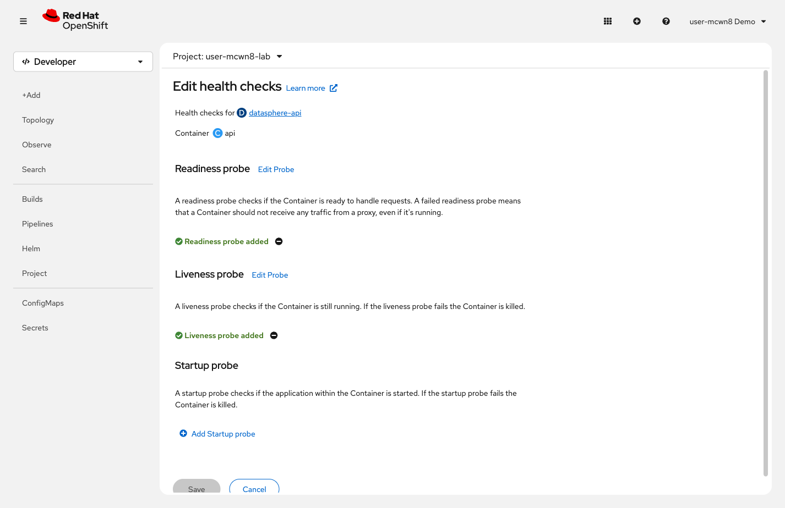
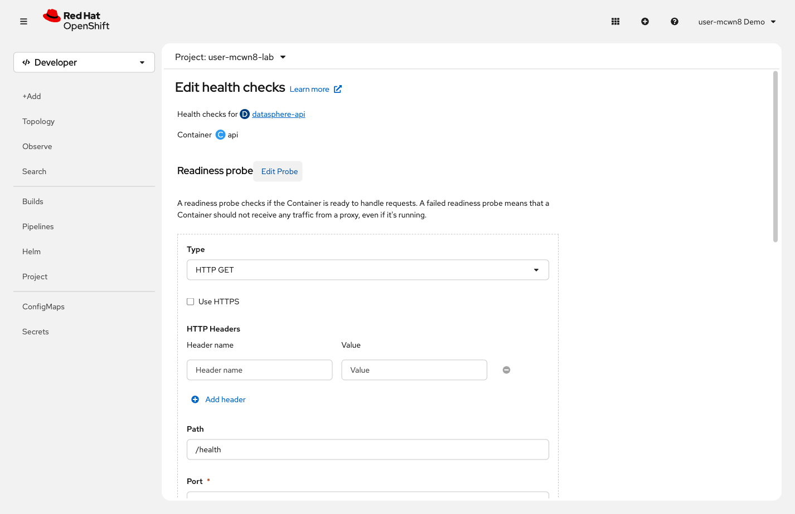

= Step 2.4: Add health probes
:source-highlighter: highlightjs

The HPA handles capacity. Health probes handle a different failure mode: a pod that's alive
and consuming normal CPU, but silently broken. Without probes, that pod keeps receiving
traffic even though every request fails.

Two probe types work together here:

* *Liveness probe*: asks "is this container alive?" -- if it fails enough times, OpenShift restarts it
* *Readiness probe*: asks "can this container handle traffic right now?" -- if it fails, the Service stops sending requests to that pod

[%collapsible]
.Using the Terminal (CLI)
====
Add a liveness probe:

[source,role="execute"]
----
oc set probe deployment/datasphere-api --liveness --get-url=http://:8080/health --initial-delay-seconds=10 --period-seconds=10 --failure-threshold=3
----

[%collapsible]
.Expected output
=====
----
deployment.apps/datasphere-api probes updated
----
=====

Add a readiness probe:

[source,role="execute"]
----
oc set probe deployment/datasphere-api --readiness --get-url=http://:8080/health --initial-delay-seconds=5 --period-seconds=5
----

[%collapsible]
.Expected output
=====
----
deployment.apps/datasphere-api probes updated
----
=====

Verify both are configured:

[source,role="execute"]
----
oc describe deployment datasphere-api | grep -E "Liveness:|Readiness:"
----

[%collapsible]
.Expected output
=====
----
    Liveness:   http-get http://:8080/health delay=10s timeout=1s period=10s #success=1 #failure=3
    Readiness:  http-get http://:8080/health delay=5s timeout=1s period=5s #success=1 #failure=3
----
=====
====

[%collapsible]
.Using the Web Console
====
. On the *datasphere-api* Deployment detail page, click *Actions* → *Add Health Checks*.

// SCREENSHOT NEEDED: Actions → Add Health Checks page on datasphere-api Deployment, showing the Liveness, Readiness, and Startup probe sections before filling them in

. Click *+ Add Liveness probe* and fill in:
+
* *Type*: `HTTP GET`
* *Path*: `/health`
* *Port*: `8080`
* *Initial delay*: `10`
* *Period*: `10`
* *Failure threshold*: `3`
+
Click the *✓* (checkmark) icon at the bottom of the probe section to confirm it.

. Click *+ Add Readiness probe* and fill in:
+
* *Type*: `HTTP GET`
* *Path*: `/health`
* *Port*: `8080`
* *Initial delay*: `5`
* *Period*: `5`
+
Click the *✓* (checkmark) icon to confirm this probe as well.

// SCREENSHOT NEEDED: Add Health Checks page with both Liveness (HTTP GET /health, port 8080, delay 10s, period 10s, failure 3) and Readiness (HTTP GET /health, port 8080, delay 5s, period 5s) filled in, before clicking Add

. Click *Add*.
====

A few settings worth knowing:

* *`initialDelaySeconds`*: How long to wait before the first check. If your app takes 30
  seconds to start up, set this to 35 -- too short and the probe restarts the app before
  it finishes booting, creating a restart loop.

* *`failureThreshold`*: How many consecutive failures before action. Setting 1 is too
  aggressive; setting 10 is too forgiving. 3 is a reasonable default.

* *`timeoutSeconds`*: How long to wait for a response before counting it as a failure.
  The default is 1 second. Increase this for health endpoints that call downstream services.
