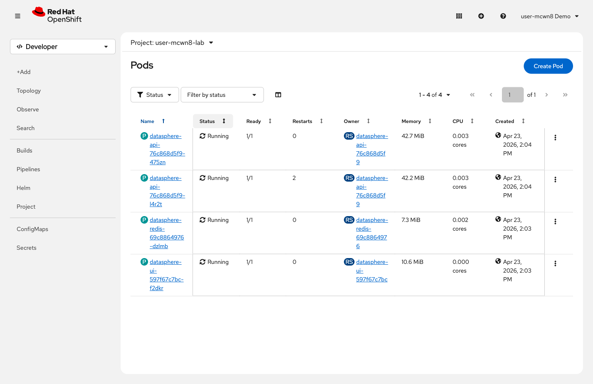

= Step 2.5: Test the probes
:source-highlighter: highlightjs

Wait for the API pods to settle after the probe rollout:

[%collapsible]
.Using the Terminal (CLI)
====
[source,role="execute"]
----
oc wait --for=condition=ready pod --selector component=api --timeout=90s
----
====

[%collapsible]
.Using the Web Console
====
In *Workloads* → *Pods*, wait until all `datasphere-api-*` pods show `1/1` in the *Ready* column.
====

Now break one pod's health:

[source,role="execute"]
----
curl -s -X POST https://$(oc get route datasphere-ui -o jsonpath='{.spec.host}')/api/break
----

[%collapsible]
.Expected output
====
----
{"status":"broken","message":"Health check will now fail. OCP will restart this pod."}
----
====

NOTE: This hit one API pod through the Service load balancer. Only that pod is broken --
the others continue serving traffic normally.

[%collapsible]
.Using the Terminal (CLI)
====
Watch the pods:

[source,role="execute"]
----
watch oc get pods --selector component=api
----

Within 30 seconds, the *RESTARTS* column increments on one pod. OpenShift detected the
unhealthy pod and restarted it automatically. Press `Ctrl+C` to stop.
====

[%collapsible]
.Using the Web Console
====
Go to *Workloads* → *Pods*. Within 40 seconds, the *Restarts* counter increments on one
API pod.

// SCREENSHOT NEEDED: Workloads → Pods in {user}-lab showing datasphere-api pods — one pod with Restarts = 1, others at 0, all Running

TIP: Click the restarted pod name and open the *Events* tab to see the liveness probe
failure events that triggered the restart.
====

No alert fired. No one had to intervene. The platform detected the sick pod and fixed it.
