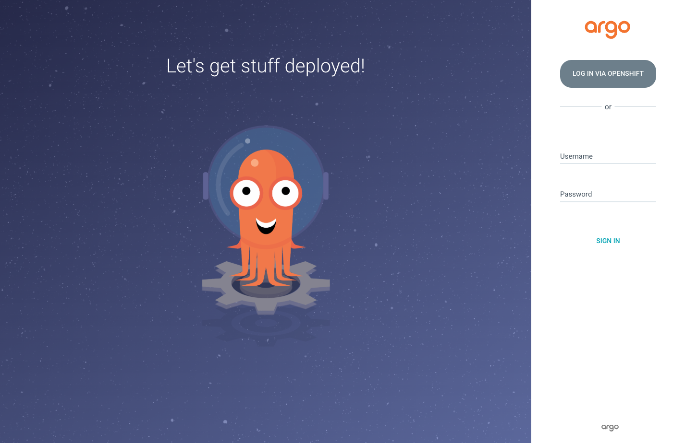

= Step 0.2: Log in to ArgoCD
:source-highlighter: highlightjs

Click the *ArgoCD* tab on the right side of this lab interface.

Click *Log in via OpenShift* and use your existing lab credentials:

* *Username*: `{user}`
* *Password*: `{password}`

If an *Authorize Access* page appears, click *Allow selected permissions* to continue.

NOTE: ArgoCD uses your OpenShift login -- no separate account needed.
The same credentials that work in the OpenShift console work here.

// SCREENSHOT NEEDED: ArgoCD login page showing the "Log in via OpenShift" button

TIP: To open ArgoCD in a separate browser window instead, use this URL:
`https://argocd-server-{user}-gitops.{openshift_cluster_ingress_domain}`

