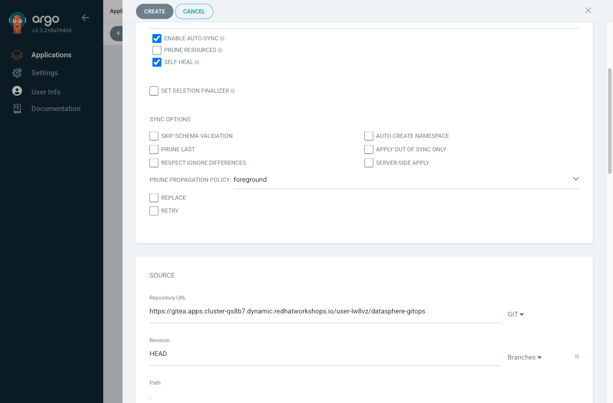

= Step 2.1: Create the Application
:source-highlighter: highlightjs

In ArgoCD, click *+ New App* in the top left.

A form panel opens on the right. Fill it in as follows:

==== General

[cols="1,2",options="header"]
|===
| Field | Value
| *Application Name* | `datasphere`
| *Project Name* | `lab`
| *Sync Policy* | Change the dropdown from *Manual* to *Automatic*
|===

After selecting Automatic, 3 checkboxes appear. Check *Self Heal*:

* *Enable Auto-Sync*: already checked
* *Prune Resources*: leave unchecked (ArgoCD won't delete resources that are removed from Git)
* *Self Heal*: check this (if someone changes the cluster directly, ArgoCD corrects it)

You'll see what Self Heal does in Section 4.

==== Source

[cols="1,2",options="header"]
|===
| Field | Value
| *Repository URL* | `pass:a[{gitea_url}/{user}/datasphere-gitops]`
| *Revision* | `HEAD`
| *Path* | `.`
|===

==== Destination

[cols="1,2",options="header"]
|===
| Field | Value
| *Cluster URL* | `\https://kubernetes.default.svc`
| *Namespace* | `{user}-gitops`
|===

Scroll down and click *Create*.

