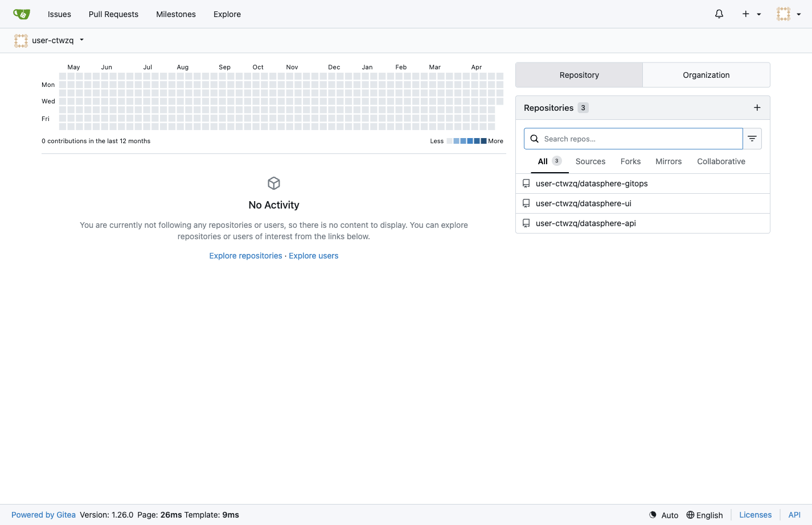
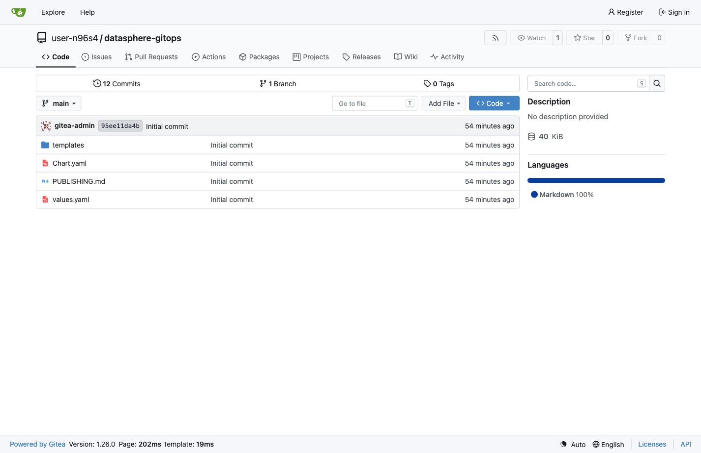

= Step 3.1: Open your Gitea repository
:source-highlighter: highlightjs

Click the *Gitea* tab on the right side of this lab interface and log in:

* *Username*: `{user}`
* *Password*: `{password}`

Once logged in, your repositories are listed on the dashboard. Click *datasphere-gitops*.

// SCREENSHOT NEEDED: Gitea dashboard after login showing the user's repositories with datasphere-gitops visible

TIP: You can also go directly to your repository:
link:{gitea_url}/{user}/datasphere-gitops[{gitea_url}/{user}/datasphere-gitops, window=_blank]

// SCREENSHOT NEEDED: Gitea repository view for {user}/datasphere-gitops showing the file list (values.yaml visible)

This is the Helm chart that ArgoCD used to deploy DataSphere. ArgoCD watches
this repository directly -- any edits you commit here are picked up on the next
sync and applied to `{user}-gitops` automatically.

