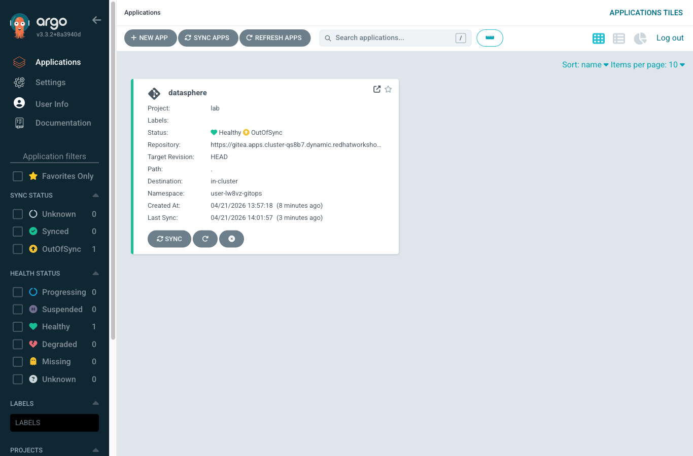
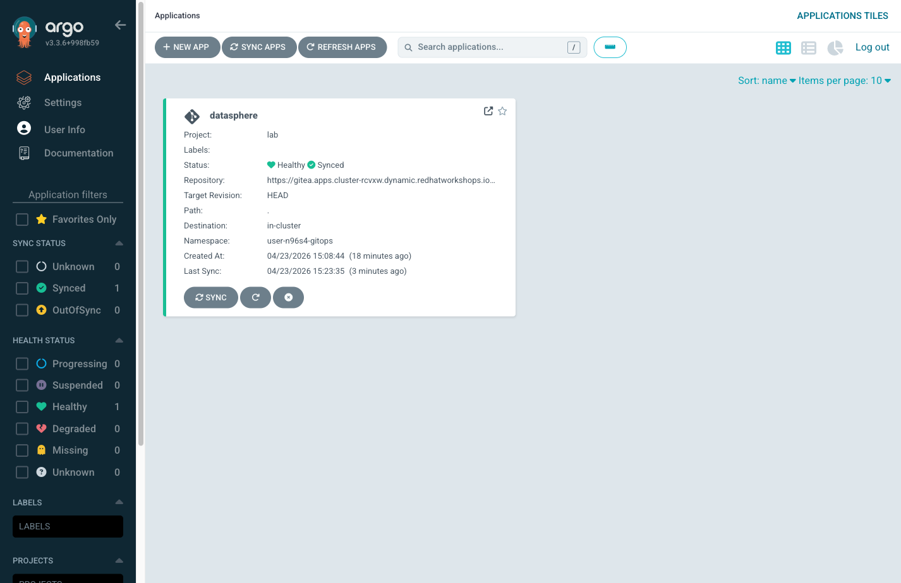

= Step 3.4: Watch ArgoCD detect and apply the change
:source-highlighter: highlightjs

Switch back to the *ArgoCD* tab. ArgoCD polls your repository every 3 minutes --
it may already be detecting the change. If the application is not already showing
*OutOfSync* or *Syncing*, click *Refresh* on the datasphere Application tile to
trigger an immediate check.

Within seconds of the refresh, the status changes to *OutOfSync* -- ArgoCD has
detected that the Git state no longer matches the cluster state.

With auto-sync enabled, ArgoCD immediately begins reconciling. You'll see the
status move through *Syncing* and back to *Synced*. The ConfigMap change triggers
a rolling restart of the API pod: ArgoCD handles the restart automatically as part
of the sync.

