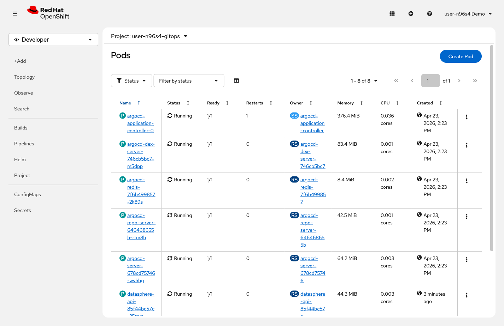

= Step 4.2: Watch ArgoCD respond
:source-highlighter: highlightjs

Switch back to the *ArgoCD* tab. ArgoCD continuously compares the cluster state
against Git -- with Self Heal enabled, it checks frequently and will detect the
scaling change on its own. If the application is not already showing *OutOfSync*,
click *Refresh* to trigger an immediate check.

The status shows *OutOfSync*: the cluster has 0 API replicas, but
`values.yaml` in Git says 1. ArgoCD knows what Git declared, and it knows what the
cluster has -- and those don't match.

Because *Self Heal* is enabled, ArgoCD restores the API to 1 replica automatically
within the next sync cycle. Optionally, watch it come back using either the CLI
or the web console:

[%collapsible]
.Using the Terminal (CLI)
====
[source,role="execute",subs="attributes+"]
----
oc get pods -n {user}-gitops
----

[%collapsible]
.Expected output
=====
----
NAME                                READY   STATUS    RESTARTS   AGE
datasphere-api-7d464fc7c4-xxxxx     1/1     Running   0          15s
datasphere-redis-69c8864976-xxxxx   1/1     Running   0          15m
datasphere-ui-597f67c7bc-xxxxx      1/1     Running   0          15m
----
=====
====

[%collapsible]
.Using the Web Console
====
In the console, switch to the *{user}-gitops* project and click
*Workloads* → *Pods*. Watch the `datasphere-api` pod return to *Running* status.

====

The API pod is back. You didn't touch it -- ArgoCD matched the cluster to Git.

If you want to scale the API to 0 permanently, there's one way to do it: commit
a change to `values.yaml` that sets `api.replicas: 0`. Then Git reflects your
intent, and the cluster follows.

