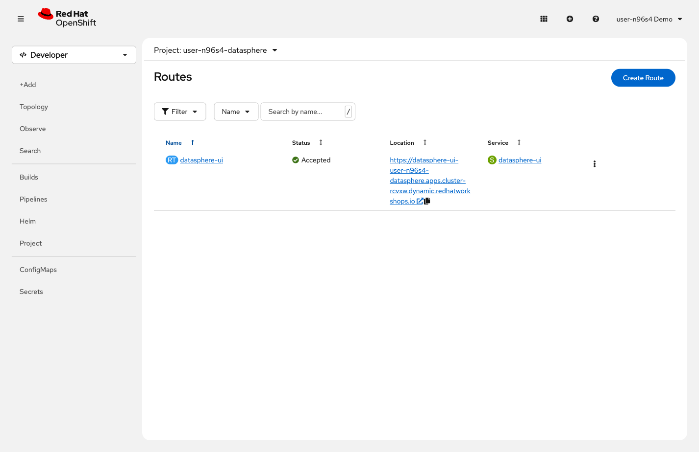

= Step 0.1: Open the pre-deployed DataSphere
:source-highlighter: highlightjs

[%collapsible]
.Using the Terminal (CLI)
====
[source,role="execute",subs="attributes+"]
----
oc get route datasphere-ui -n {user}-datasphere
----

Copy the URL from the `HOST` column and open it in a new browser tab.
====

[%collapsible]
.Using the Web Console
====
In the OpenShift console, click *`{user}-datasphere`* in the project list.
In the left navigation, expand *Networking* and click *Routes*.
Click the URL in the *Location* column for `datasphere-ui`.

// SCREENSHOT NEEDED: Networking → Routes in {user}-datasphere showing the datasphere-ui route with its URL in the Location column

====

In this lab you won't run `oc` commands or `helm install` to deploy DataSphere.
Instead, you'll tell ArgoCD where your Helm chart lives in Gitea -- and ArgoCD
handles deployment, updates, and drift correction automatically from that point on.

