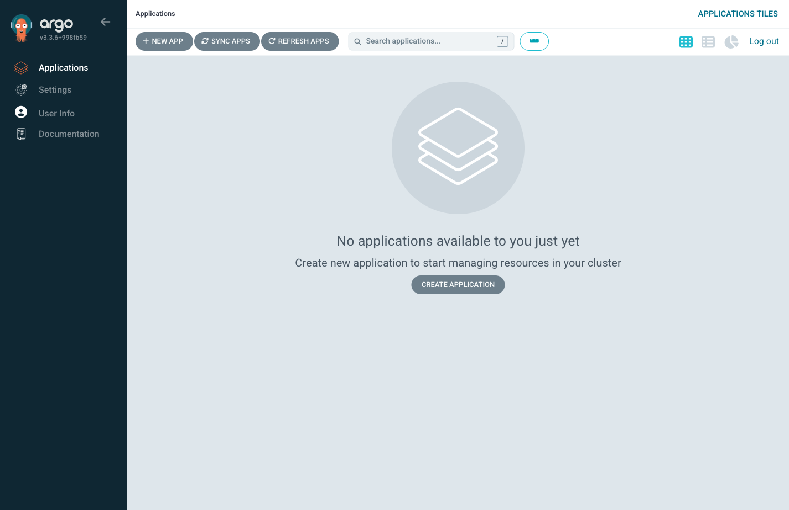

= Step 1.1: Confirm your ArgoCD instance is empty
:source-highlighter: highlightjs

After logging in, you'll see the ArgoCD dashboard with no applications listed.
That's expected -- your ArgoCD instance starts empty. You'll register the first
application in Section 2.

ArgoCD is a *GitOps controller*: a process that runs inside the cluster, watches
one or more Git repositories, and continuously reconciles the cluster state to match
what's declared in Git. When you tell ArgoCD about a Git repository, it creates an
*Application* -- a link between a Git source and a cluster destination. ArgoCD polls
that source on a regular interval and applies any changes it finds.

Your ArgoCD instance manages only your own namespaces -- it cannot see or affect
other students' resources. Let's give it something to manage.

