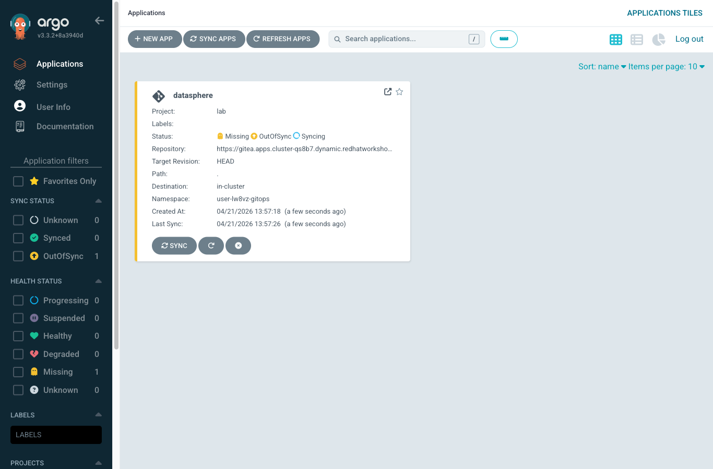
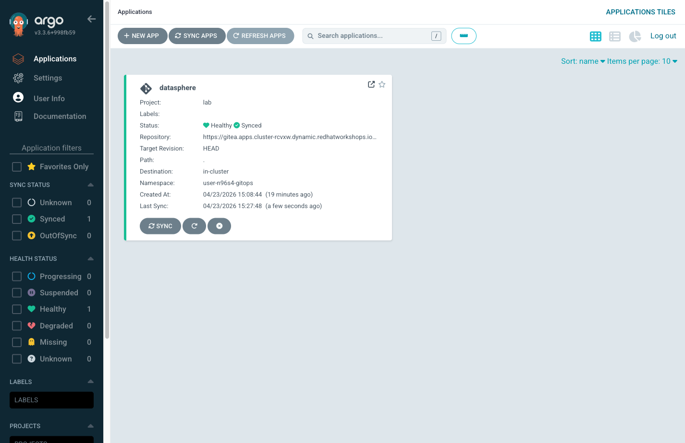
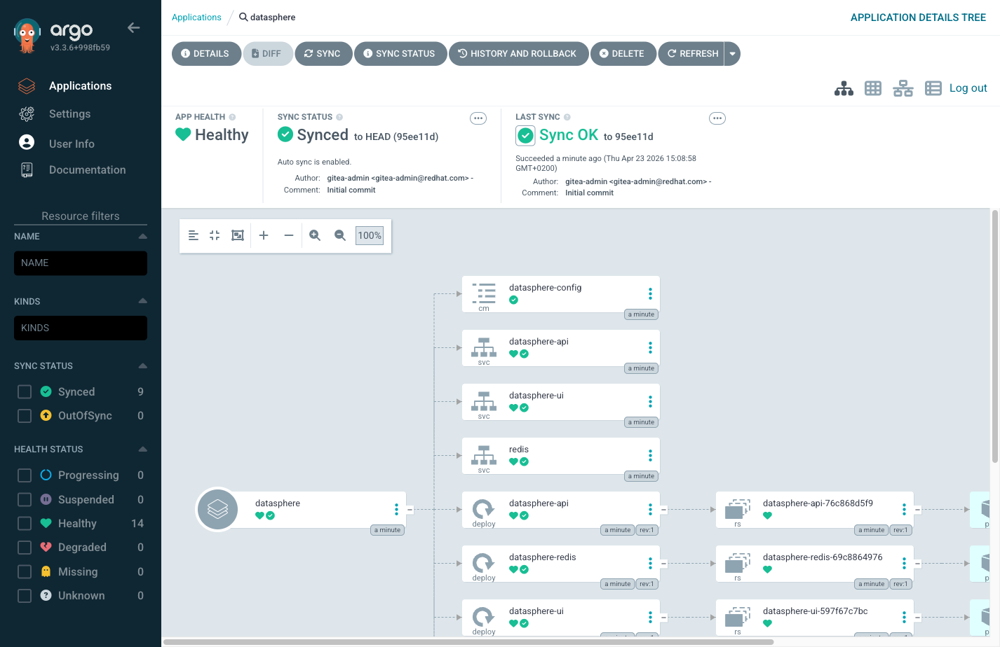

= Step 2.2: Watch it sync
:source-highlighter: highlightjs

After creation, the Application tile appears on the dashboard. The status shows
*Syncing* as ArgoCD fetches your repository, renders the Helm chart, and applies
the resulting resources to `{user}-gitops`.

Within about 60 seconds, the status changes to *Synced* and *Healthy*:

Click the *datasphere* application tile to open its detail view. You'll see every
resource ArgoCD deployed: 3 Deployments, 3 Services, 1 Route, 1 HPA, and the
ConfigMaps that configure them. This is your full DataSphere stack, declared in
Git and reconciled here automatically.

While you're here, notice the left sidebar navigation:

* *Applications*: the list of Git-managed deployments -- the `datasphere` tile you just created
* *Settings*: where repositories, clusters, and projects are configured

The *SYNC STATUS* and *HEALTH STATUS* badges on the tile tell you at a glance
whether Git and the cluster agree, and whether the deployed resources are functioning.
You'll watch both change as the lab progresses.

