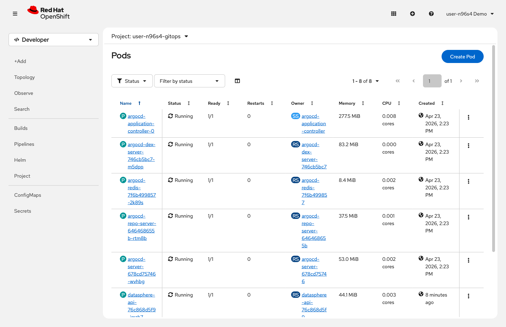

= Step 2.3: Verify the deployment
:source-highlighter: highlightjs

Use either the CLI or the web console to confirm the pods are running:

[%collapsible]
.Using the Terminal (CLI)
====
Switch to your gitops project and check what's running:

[source,role="execute",subs="attributes+"]
----
oc project {user}-gitops
----

[source,role="execute"]
----
oc get pods
----

[%collapsible]
.Expected output
=====
----
NAME                                READY   STATUS    RESTARTS   AGE
argocd-application-controller-0     1/1     Running   0          10m
argocd-dex-server-xxxxxxxxxx-xxxxx  1/1     Running   0          10m
argocd-redis-xxxxxxxxxx-xxxxx       1/1     Running   0          10m
argocd-repo-server-xxxxxxxxxx-xx    1/1     Running   0          10m
argocd-server-xxxxxxxxxx-xxxxx      1/1     Running   0          10m
datasphere-api-7d464fc7c4-xxxxx     1/1     Running   0          2m
datasphere-redis-69c8864976-xxxxx   1/1     Running   0          2m
datasphere-ui-597f67c7bc-xxxxx      1/1     Running   0          2m
----
=====

You'll see 8 pods in total. The 5 `argocd-*` pods are your personal ArgoCD
instance -- it lives in the same project so it can manage resources here
directly. The 3 `datasphere-*` pods are the application ArgoCD just deployed.
====

[%collapsible]
.Using the Web Console
====
In the OpenShift console, click the *Project* dropdown at the top of the page
and select *{user}-gitops*.

In the left navigation, click *Workloads* → *Pods*.

You'll see 8 pods in total. The 5 `argocd-*` pods are your personal ArgoCD
instance -- it lives in the same project so it can manage resources here
directly. The 3 `datasphere-*` pods are the application ArgoCD just deployed.
====

NOTE: In this lab, each student gets their own ArgoCD instance for isolation.
In a real cluster, you would typically run a single ArgoCD instance that manages
applications across all namespaces.

