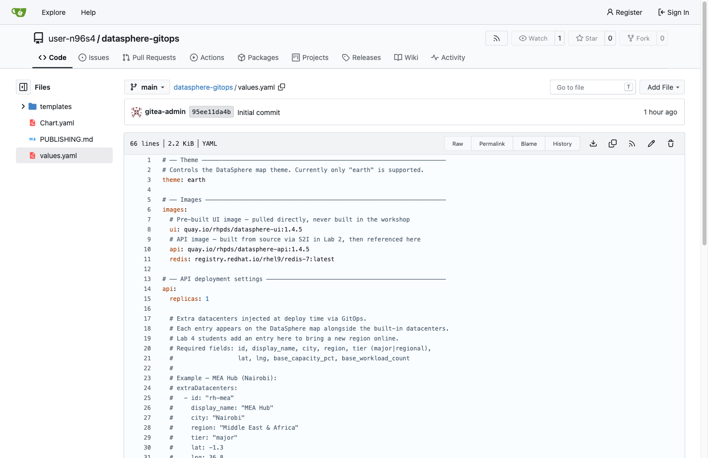

= Step 3.2: Edit values.yaml
:source-highlighter: highlightjs

Click `values.yaml` in the file list.

Click the *pencil icon* (Edit this file) in the top-right corner of the file view.

Find the `extraDatacenters: []` line in the `api:` section.

Replace `extraDatacenters: []` with the following block.

IMPORTANT: Use *2 spaces* per indent level -- not tabs. The Gitea editor may default to
4-space tabs, so type the spaces manually or adjust the editor settings. YAML will break
if the indentation is wrong.

[source,yaml,role="copypaste"]
----
  extraDatacenters:
    - id: "rh-mea"
      display_name: "MEA Hub"
      city: "Nairobi"
      region: "Middle East & Africa"
      tier: "major"
      lat: -1.3
      lng: 36.8
      base_capacity_pct: 45
      base_workload_count: 892
----

The `extraDatacenters` key must be indented 2 spaces under `api:` to match the
rest of the file.

