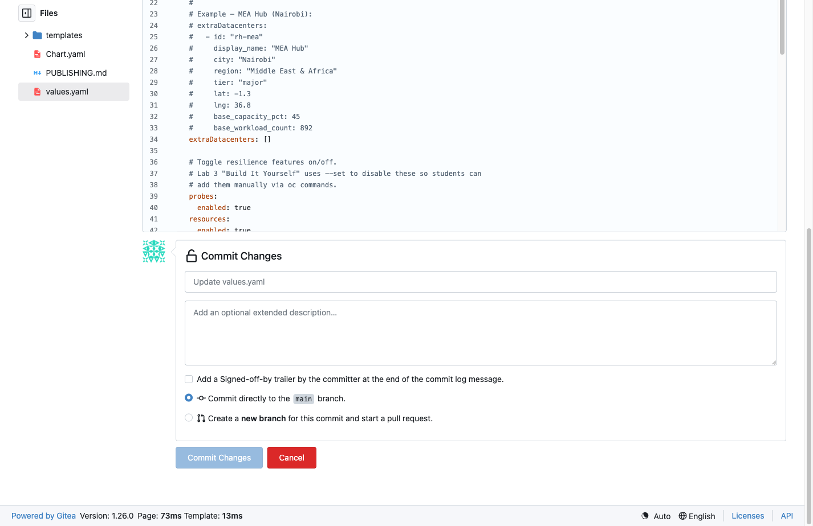

= Step 3.3: Commit the change
:source-highlighter: highlightjs

Scroll down to the *Commit Changes* section. Enter a commit message:

[source,role="copypaste"]
----
Add MEA Hub (Nairobi) -- bring Middle East and Africa region online
----

Leave all other settings at their defaults and click *Commit Changes*.

// SCREENSHOT NEEDED: Gitea Commit Changes section with the commit message filled in, before clicking Commit Changes

