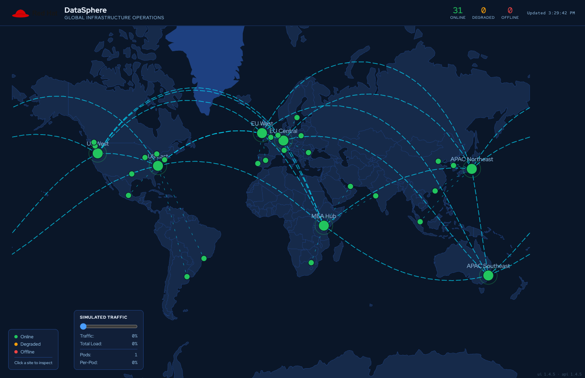

= Step 3.5: Verify on the DataSphere map
:source-highlighter: highlightjs

Reload the link:https://datasphere-ui-{user}-gitops.{openshift_cluster_ingress_domain}/[DataSphere app, window=_blank] you opened in Step 2.4. A new hub dot appears in East Africa.
Backbone arcs connect Nairobi to all other major hubs globally.

// SCREENSHOT NEEDED: DataSphere app showing the MEA Hub (Nairobi) as a new major hub in East Africa with backbone arcs connecting it to other major hubs

You made 1 commit. ArgoCD handled the rest.

If you want to confirm the change landed in the cluster, the CLI can show you
exactly what ArgoCD wrote to the ConfigMap:

[%collapsible]
.Using the Terminal (CLI)
====
[source,role="execute",subs="attributes+"]
----
oc get configmap datasphere-config -n {user}-gitops -o jsonpath='{.data.extra_datacenters\.json}'
----

[%collapsible]
.Expected output
=====
----
[{"id": "rh-mea", "display_name": "MEA Hub", "city": "Nairobi", ...}]
----
=====
====

