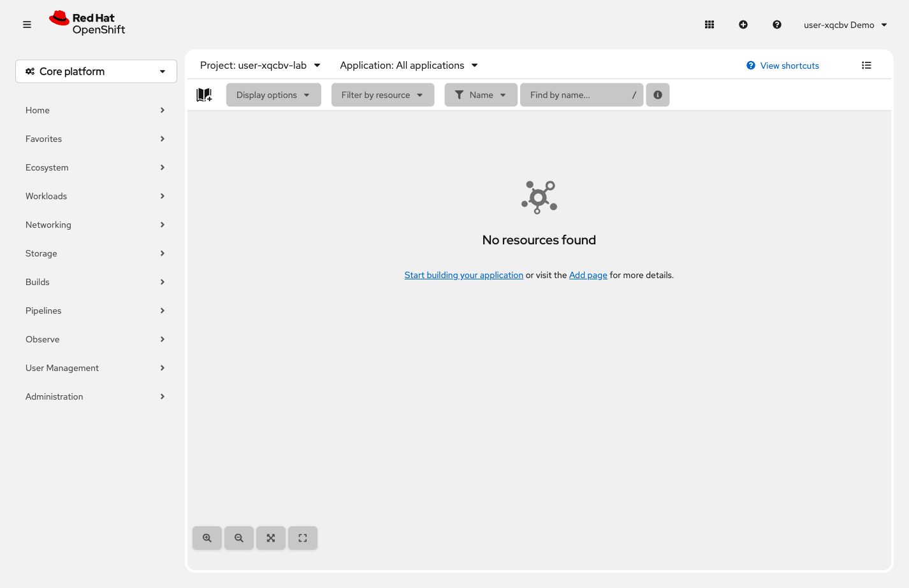

= Step 2.1: Switch to your clean project
:source-highlighter: highlightjs

[%collapsible]
.Using the Terminal (CLI)
====
[source,role="execute",subs="attributes+"]
----
oc project {lab-namespace}
----
====

[%collapsible]
.Using the Web Console
====
In the left navigation, expand *console:qs-nav-home[Home]*, select *Project*, then choose the *`{lab-namespace}`* project.

// SCREENSHOT NEEDED: Developer perspective Topology view showing {lab-namespace} selected and "No resources found" / empty state

====

This project is empty -- a clean workspace for you to build in.

