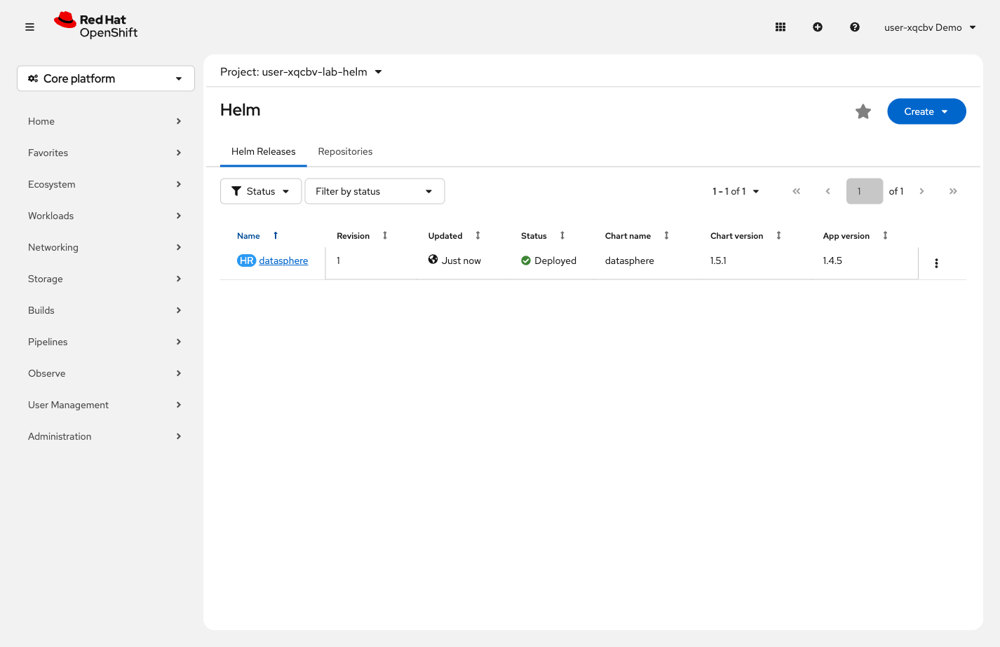

= Step 3.2: Switch to the Helm project and deploy
:source-highlighter: highlightjs

Switch to `{lab-helm-namespace}` -- this is a separate, clean namespace for the Helm deployment:

[%collapsible]
.Using the Terminal (CLI)
====
[source,role="execute",subs="attributes+"]
----
oc project {lab-helm-namespace}
----

Install the DataSphere chart -- this deploys UI, API, and Redis in one command:

[source,role="execute",subs="attributes+"]
----
helm install datasphere https://{gitea-rootUrl}/gitea-admin/datasphere-gitops/archive/main.tar.gz
----

[%collapsible]
.Expected output
=====
[subs="attributes+"]
----
NAME: datasphere
LAST DEPLOYED: ...
NAMESPACE: {lab-helm-namespace}
STATUS: deployed
REVISION: 1
DESCRIPTION: Install complete
TEST SUITE: None
----
=====

`REVISION: 1` tells you this is the first install. Each `helm upgrade` increments the revision
and Helm keeps the history -- you can roll back to any previous revision.

Wait for all components:

[source,role="execute"]
----
oc rollout status deployment/datasphere-ui && oc rollout status deployment/datasphere-api
----

[%collapsible]
.Expected output
=====
----
deployment "datasphere-ui" successfully rolled out
deployment "datasphere-api" successfully rolled out
----
=====
====

[%collapsible]
.Using the Web Console
====
In the Project selector, switch to *`{lab-helm-namespace}`*.

NOTE: The DataSphere chart is served from a direct Gitea URL and is not registered in the
OpenShift Helm catalog. Run the `helm install` command from the Terminal as shown in the CLI
steps above, then return here to verify the result.

After the `helm install` completes, expand *Ecosystem* and click *Helm* in the left navigation. The *datasphere*
release appears with *Status: deployed* and *Revision: 1*.

// SCREENSHOT NEEDED: Helm Releases page in {lab-helm-namespace} showing the datasphere release with Status: deployed and Revision: 1

====

